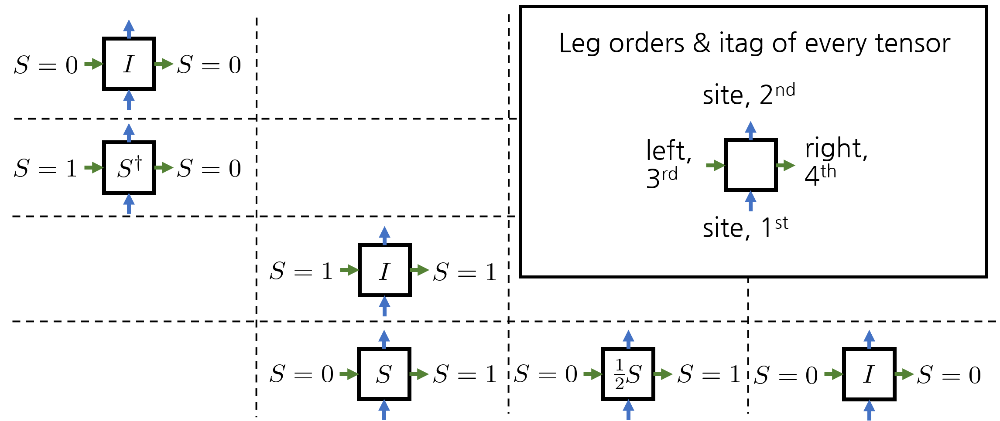
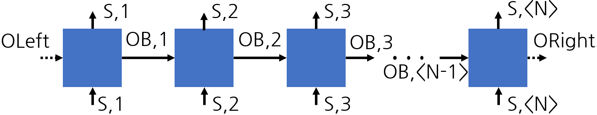
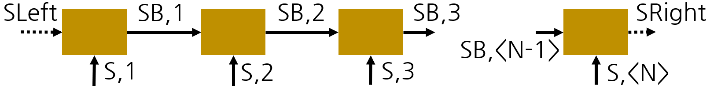
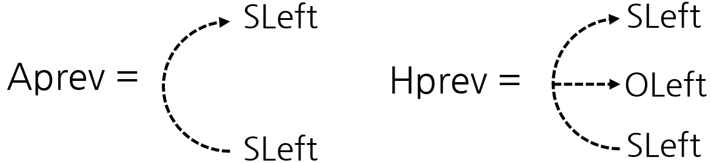
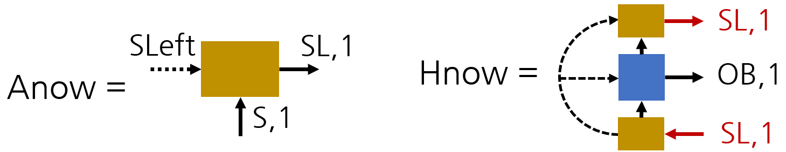
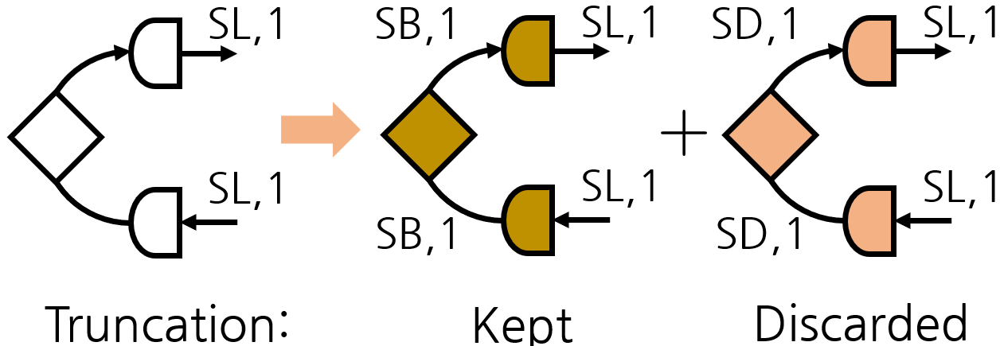
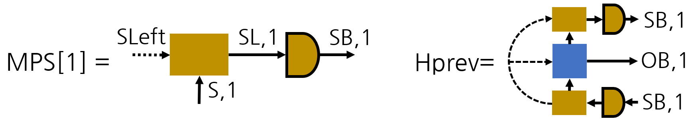
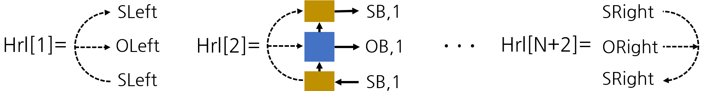
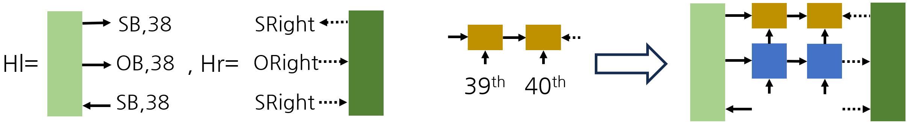
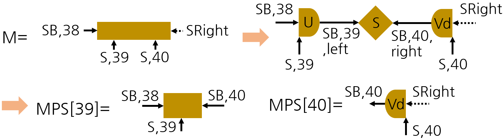

# 2-site DMRG tutorial

## 1. Building MPO

With the functions I introduced before, various tensor network algorithms can be implemented. Here, we'll get the ground state energy of the well-known Majumdar-Ghosh system. Its Hamiltonian is 

```@repl dmrg_tutorial
using Telum

[1 0; 0 1] ⊗ [1 2; 3 4]
```

```math
H = \sum_{i} \left( \vec{S}_i \cdot \vec{S}_{i+1} + \frac{1}{2} \vec{S}_i \cdot \vec{S}_{i+2} \right)
```

Without exploiting symmetry, the MPO for the Hamiltonian is

```math
\begin{pmatrix} 
I & 0 & 0 & 0 & 0 & 0 & 0 & 0 \\
S^x & 0 & 0 & 0 & 0 & 0 & 0 & 0 \\
S^y & 0 & 0 & 0 & 0 & 0 & 0 & 0 \\
S^z & 0 & 0 & 0 & 0 & 0 & 0 & 0 \\
0 & I & 0 & 0 & 0 & 0 & 0 & 0 \\
0 & 0 & I & 0 & 0 & 0 & 0 & 0 \\
0 & 0 & 0 & I  & 0 & 0 & 0 & 0 \\
0 & S^x & S^y & S^z & \frac{1}{2}S^x & \frac{1}{2}S^y & \frac{1}{2}S^z & I
\end{pmatrix}
```

Since the system has SU(2) spin symmetry, we can use spin IROP instead of the vector of operations \(S^x, S^y, S^z\). Let \(S\) be the SU(2) spin IROP. Then the MPO is simplified as

```math
\begin{pmatrix} 
I_{S=0} & 0 & 0 & 0  \\
S^{\dagger} & 0 & 0 & 0  \\
0 & I_{S=1} & 0 & 0  \\
0 & S & \frac{1}{2}S & I_{S=0}  \\
\end{pmatrix}
```

The first and last columns/rows correspond to \(S=0\) spaces, and \(S=1\) for other columns/rows. The \(I\) in (1, 1) and (4, 4) indices, acting on \(S=0\) space, differ from \(I\) in (3, 2) index. To define such a rank-4 tensor, we need to 1) generate appropriate operators and 2) concatenate them to construct a large operator. The oplus function with matrix input will be used.

```@repl dmrg_tutorial
using LurCGT
using Telum
using LinearAlgebra
option = SpinOptions(:SU2, 1)
q = getLocalSpace(option, ("site", "site", "op"));
```

Our goal is to construct a matrix of tensors as below. Every tensor is 4-dimensional, and the first two legs are for local \(S=1/2\) spaces, with the itag "site". 



First, load necessary packages and get local operators for a single spin 1/2 site. We can set the itags of resulting operators. The code below fills identities at the (1, 1) and (4, 4) indices.

```@repl dmrg_tutorial
qss = Matrix{TLArray}(undef, 4, 4) # Empty 4*4 matrix of tensors.
i4d = addSingleton(q.I; nlegs=2, itag=("left", "right"), dir=('+', '-'))
qss[1, 1] = qss[4, 4] = i4d
```

Output:

```text
4D TLArray, 1 symmetries [SU2]  ["site+", "site-", "left+", "right-"]
  1.	1x1x1x1	| 2x2x1x1	[ 1 ; 1 ; 0 ; 0 ]	1.414214
```

The code below does similar things. Convince yourself that the code below results in the figure above.

```@repl dmrg_tutorial
s4d = addSingleton(q.S, 3; itag="left", dir='+')
s4d = setitag(s4d, 4, "right")
# Put S and S/2 at the last row of the matrix.
qss[4, 2] = s4d;
qss[4, 3] = 1/2 * s4d;
```

```@repl dmrg_tutorial
# Generate conjugate spin IROP
sc4d = addSingleton(q.S'; itag="right", dir='-')
sc4d = permutedims(setitag(sc4d, 3, "left"), (2, 1, 3, 4))
qss[2, 1] = sc4d;
```

```@repl dmrg_tutorial
id_S1 = getIdentity(q.S, 3) # Identity on S=1 space
id_S1 = TLArray(id_S1, ("left", "right"))
qss[3, 2] = q.I ⊗ id_S1
```

Output:

```text
4D TLArray, 1 symmetries [SU2]  ["site+", "site-", "left+", "right-"]
  1.	1x1x1x1	| 2x2x3x3	[ 1 ; 1 ; 2 ; 2 ]	-2.449490
```

After completing the matrix of tensors, call the oplus function to generate a 4-dimensional MPO tensor. 

oplus(matrix, (dim1, dim2)) => Tensors in same column(row) are concatenated through leg dim1(dim2). An integer and a Vector/Tuple of integers can come for dim1 and dim2. Empty entries in the matrix are allowed.

An error occurs when there is any ambiguity in determining the spaces and leg direction of the resulting tensor. For example, tensors in the same column should have the same space lists for the i(∉dim1)th legs. The relative position of the tensor is preserved when getting RMT for the new tensor.

```@repl dmrg_tutorial
t = oplus(qss, (3, 4))
```

Output:

```text
4D TLArray, 1 symmetries [SU2]  ["site+", "site-", "left+", "right-"]
  1.	1x1x2x2	| 2x2x1x1	[ 1 ; 1 ; 0 ; 0 ]
  2.	1x1x2x2	| 2x2x1x3	[ 1 ; 1 ; 0 ; 2 ]
  3.	1x1x2x2	| 2x2x3x1	[ 1 ; 1 ; 2 ; 0 ]
  4.	1x1x2x2	| 2x2x3x3	[ 1 ; 1 ; 2 ; 2 ]
```

The next step is to get the MPO tensor for the first & last site. For the first site, only the last column should be selected, which corresponds to the last copy of S=0 space for the 3rd leg. Similarly, for the last site, only the first copy of the S=0 space survives for the 4th leg. 

After truncation and tagging, MPO is organized as a vector of tensors. The resulting MPO is shown in the figure below.



```@repl dmrg_tutorial
N = 40 # Our system size
zq = zero_qlabels(t) # qlabel for vacuum space. ((0,),) in this case
MPO = Vector{TLArray{Float64, 4}}(undef, N) 
for i in 1:N
    tags = ("S,$i", "S,$i", i>1 ? "OB,$(i-1)" : "OLeft", i<N ? "OB,$i" : "ORight")

    if i == 1 MPO[i] = TLArray(getsub(t, 3, x->x==zq ? -1 : nothing), tags) # Last copy of vacuum space
    elseif i == N MPO[i] = TLArray(getsub(t, 4, x->x==zq ? 1 : nothing), tags) # First copy of vacuum space
    else MPO[i] = TLArray(t, tags) end
end
println(MPO[1])
println(MPO[20])
println(MPO[40])
```

Output:

```text
4D TLArray, 1 symmetries [SU2]  ["1,S+", "1,S-", "OLeft+", "1,OB-"]
  1.	1x1x1x2	| 2x2x1x1	[ 1 ; 1 ; 0 ; 0 ]
  2.	1x1x1x2	| 2x2x1x3	[ 1 ; 1 ; 0 ; 2 ]
4D TLArray, 1 symmetries [SU2]  ["20,S+", "20,S-", "19,OB+", "20,OB-"]
  1.	1x1x2x2	| 2x2x1x1	[ 1 ; 1 ; 0 ; 0 ]
  2.	1x1x2x2	| 2x2x1x3	[ 1 ; 1 ; 0 ; 2 ]
  3.	1x1x2x2	| 2x2x3x1	[ 1 ; 1 ; 2 ; 0 ]
  4.	1x1x2x2	| 2x2x3x3	[ 1 ; 1 ; 2 ; 2 ]
4D TLArray, 1 symmetries [SU2]  ["40,S+", "40,S-", "39,OB+", "ORight-"]
  1.	1x1x2x1	| 2x2x1x1	[ 1 ; 1 ; 0 ; 0 ]
  2.	1x1x2x1	| 2x2x3x1	[ 1 ; 1 ; 2 ; 0 ]
```

## 2. Initializing MPS by iterative diagonalization

The next step is to initialize MPS. The resulting MPS looks like the figure below. Let's see how the first iteration is done.



First, initialize Aprev and Hprev, which is a result from last iteration. The getvac function creates a rank-2 identity tensor on vacuum space. The first argument is a tensor, but only symmetry information is used. The second argument is the itag of each leg.



```@repl dmrg_tutorial
Nkeep_init = 50
N = length(MPO) # 40
MPS = Vector{TLArray{Float64, 3}}(undef, N)
zq = zero_qlabels(MPO[1]) # qlabel for vacuum space. ((0,),) in this case

Aprev = getvac(MPO[1], ("SLeft", "SLeft"))
Hprev = addSingleton(Aprev; itag="OLeft", dir='-') # Contracted to the leftmost leg of the MPO
```

Output:

```text
3D TLArray, 1 symmetries [SU2]  ["SLeft+", "SLeft-", "OLeft-"]
  1.	1x1x1	| 1x1x1	[ 0 ; 0 ; 0 ]	1.000000
```

The next step is to get an MPS for the first site. Define it from getIdentity and contract tensors to get Hnow. The code A\*B\*C without parentheses is calculated from left to right, i.e., A*B is done first. The lock function is included to avoid unwanted contraction of the two red legs.

'SL' means 'large space' came from combining the last bond space and the site space. A part of it will be truncated.



```@repl dmrg_tutorial
li = findleg(Aprev; dir='-')
Anow = getIdentity((Aprev, li), (MPO[1], 2); itag="SL,1")
Hnow = Anow' * lock(Anow * Hprev * MPO[1]; itag="SL,1")
```

Output:

```text
3D TLArray, 1 symmetries [SU2]  ["1,SL+", "1,SL-", "1,OB-"]
  1.	1x1x2	| 2x2x1	[ 1 ; 1 ; 0 ]
  2.	1x1x2	| 2x2x3	[ 1 ; 1 ; 2 ]
```

To diagonalize it, we need to remove the leg 'OB,1'. It is done in two steps.

1. Truncate a leg to a single vacuum space, similarly to the last site of MPO. The target leg become singleton.

2. Delete a singleton leg by the deleteSingleton function.

```@repl dmrg_tutorial
Hmat = getsub(Hnow, x->x==zq ? 1 : nothing; itag="OB,1")
Hmat = deleteSingleton(Hmat; itag="OB,1")
```

Output:

```text
2D TLArray, 1 symmetries [SU2]  ["1,SL+", "1,SL-"]
  (empty)
```

Diagonalize and keep only the 'Nkeep' smallest eigenvalues and eigenvectors. This function 1) checks whether the array is Hermitian, then 2) divides cases and treats them separately. If the input array is Hermitian, it skips checking and run Hermitian version.

There is an argument 'tol' for the discard_eigen function, 0.1 by default. If tol > 0, look at 'Nkeep * tol' more eigenvalues, then find the largest difference between adjacent entries. This becomes the new cutoff. This is introduced to keep the degeneracy near threshold as much as possible.

The code below has no discarded space because there is only one eigenvalue.



```@repl dmrg_tutorial
e = eigen((Hmat + Hmat') / 2; hermitian=true)
ek, ed = discard_eigen(e, Nkeep_init, "SB,1", "SD,1"; tol=0.0);
```

The last step is to 1) complete the MPS for the first site, and 2) prepare for the next iteration. The tensors created in this step are shown in the figure below.



```@repl dmrg_tutorial
MPS[1] = Aprev = Anow * ek.V
Hprev = lock(ek.V * Hnow; itag="SB") * ek.V'
```

Output:

```text
3D TLArray, 1 symmetries [SU2]  ["1,SB-", "1,OB-", "1,SB+"]
  1.	1x2x1	| 2x1x2	[ 1 ; 0 ; 1 ]
  2.	1x2x1	| 2x3x2	[ 1 ; 2 ; 1 ]
```

The full initialization code is shown below. For the last state, only the lowest eigenvalue survives. Also, the direction of the rightmost dummy leg is inverted.

```@repl dmrg_tutorial
function init_MPS(MPO::Vector{<:TLArray}, Nkeep::Int, Nkeep_last::Int=1; tol=0.0)
    N = length(MPO); MPS = Vector{TLArray{Float64, 3}}(undef, N)
    zq = zero_qlabels(MPO[1])
    Aprev = getvac(MPO[1], ("SLeft", "SLeft"))
    Hprev = addSingleton(Aprev; itag="OLeft", dir='-')
    E, sp = nothing, nothing

    for i=1:N
        li = findleg(Aprev; itag=i==1 ? "SLeft" : "SB", dir='-')
        Anow = getIdentity((Aprev, li), (MPO[i], 2); itag="SL,$i")
        Hnow = Anow' * lock(Anow * Hprev * MPO[i]; itag="SL,$i")

        bli = findleg(Hnow; itag=i==N ? "ORight" : "OB,$i")
        Hmat = deleteSingleton(getsub(Hnow, bli, x->x==zq ? 1 : nothing), bli)
        e = eigen((Hmat + Hmat') / 2)

        ek, _ = discard_eigen(e, i==N ? Nkeep_last : Nkeep, i==N ? "SRight" : "SB,$i", "SD,$i"; tol)
        MPS[i] = Aprev = Anow * ek.V
        if i < N Hprev = lock(ek.V * Hnow; itag="SB") * ek.V'
        else E, sp = ek.eig_list[1][1], ek.eig_list[1][3] end
    end
    return MPS, E, sp
end

MPS, E, sp = init_MPS(MPO, Nkeep_init, 1);
println("Energy after initialization: ", E)
println("Quantum numbers of the ground state: ", sp)
```

Output:

```text
Energy after initialization: -14.981207631353557
Quantum numbers of the ground state: ((0,),)
```

## 3. Get initial environment

The next step is to get the left and right environments used in the 2-site sweep. A vector of tensors 'Hlr' with length N+2 is created, and its elements are shown in the figure below.



```@repl dmrg_tutorial
function getHrl(MPO, MPS)
    N = length(MPS)
    Hrl = Vector{TLArray}(undef, N + 2)

    li = findleg(MPS[1]; itag="SLeft")
    left_id = getIdentity((MPS[1]', li); itag="SLeft")
    Hrl[1] = addSingleton(left_id; itag="OLeft", dir='-')

    li = findleg(MPS[end]; itag="SRight")
    right_id = getIdentity((MPS[end], li); itag="SRight")

    Hrl[end] = addSingleton(right_id; itag="ORight", dir='+')
    for i in 1:N Hrl[i+1] = MPS[i]' * lock(Hrl[i] * MPS[i] * MPO[i]; itag="SB,$i") end
    return Hrl
end

Hrl = getHrl(MPO, MPS);
```

## 4. Sweep

Before starting sweep, the direction of rightmost dummy leg of MPS and matching legs of Hlr[end] are inverted for to meet the arrow convention for MPS algorithm.

```@repl dmrg_tutorial
MPS[N] = legflip(MPS[N]; itag="SRight");
Hrl[end] = legflip(Hrl[end]; itag="SRight");
```

Let's see how a first step of right-to-left sweep is implemented. Initial state vector is MPS[39] * MPS[40], and left(Hl) & right(Hr) environments are given below. To use Lanczos algorithm, we need to get the contraction result in the figure below.



```@repl dmrg_tutorial
# Preparing environments, MPS, and MPO
M = MPS[39] * MPS[40];
Hl, Hr = Hrl[39], Hrl[42];
MPO1, MPO2 = MPO[39], MPO[40];
```

```@repl dmrg_tutorial
Amul = Hl * M 
Amul = Amul * MPO1
Amul = Amul * MPO2
Amul = Amul * Hr
println(Amul)
```

Output:

```text
4D TLArray, 1 symmetries [SU2]  ["38,SB+", "39,S+", "40,S+", "SRight+"]
  1.	22x1x1x1	| 1x2x2x1	[ 0 ; 1 ; 1 ; 0 ]
  2.	26x1x1x1	| 3x2x2x1	[ 2 ; 1 ; 1 ; 0 ]
```

The inner product of input and output tensors can be obtained form the code below. t[] is a syntax for getting a scalar value from 0-dimensional tensor. Since M and Amul share same legs, the contraction result is 0-dimensional.

```@repl dmrg_tutorial
inner_prod = (M' * Amul)[]
```

Output:

```text
-14.981207631353522
```

The function for full Lanczos algorithm is shown here. They have identical variable names to the code above. Hs is the list of MPO tensors, [MPO[39], MPO[40]] in this case.

```@repl dmrg_tutorial
function eigs_GS(Hl, Hs, Hr, M; tol=1e-8, nKrylov=5)
    # solve the effective Hamiltonian eigenvalue problem by Lanczos method
    # return the ground state and energy
    As = Vector{TLArray}(undef, nKrylov)
    As[1] = M / norm(M)
    αs = zeros(nKrylov); βs = zeros(nKrylov-1)
    cnt = 0

    # Get alpha and beta coefficients for the Lanczos tridiagonal matrix
    for i in 1:nKrylov
        Amul = Hl * As[i]
        for H in Hs Amul = Amul * H end
        Amul = Amul * Hr
        αs[i] = (As[i]' * Amul)[]
        cnt += 1

        if i < nKrylov
            for _=1:2
                coeff = [(As[j]' * Amul)[] for j in 1:i]
                Amul = sum([Amul, [-coeff[j] * As[j] for j in 1:i]...]) # Not to generate partial summations
            end
            Anorm = norm(Amul)
            if Anorm < tol break end
            As[i+1] = Amul / Anorm
            βs[i] = Anorm
        end
    end

    Hkrylov = SymTridiagonal(αs[1:cnt], βs[1:cnt-1])
    _, V = eigen(Hkrylov); vec = V[:, 1]
    Anew = sum([vec[i] * As[i] for i in 1:cnt])
    Enew = Hl * Anew
    for H in Hs Enew = Enew * H end
    Enew = ((Enew * Hr) * Anew')[]
    @assert imag(Enew) < tol
    return Anew, real(Enew)
end
```

Output:

```text
eigs_GS (generic function with 1 method)
```

Suppose we got a new local tensor. Here is the code to perform svd and generate new MPS tensors for next iteration.



```@repl dmrg_tutorial
M, E = eigs_GS(Hl, [MPO1, MPO2], Hr, M)
println("New local tensor: ")
println(M)
println("Energy from Lanczos: ", E)
```

Output:

```text
New local tensor: 
4D TLArray, 1 symmetries [SU2]  ["38,SB+", "39,S+", "40,S+", "SRight+"]
  1.	22x1x1x1	| 1x2x2x1	[ 0 ; 1 ; 1 ; 0 ]
  2.	26x1x1x1	| 3x2x2x1	[ 2 ; 1 ; 1 ; 0 ]
Energy from Lanczos: -14.983487706845967
```

```@repl dmrg_tutorial
# Perform svd on M
# Two strings after M: itag of two legs of singular value tensor S
# itag=("SB,38", "S,39"): Legs with itag "SB,38" or "S,39" go to the left tensor U
# Nkeep=50: 50 largest singular values are kept in the decomposition
res = svd(M, "SB,39,left", "SB,40,right"; itag=("SB,38", "S,39"), Nkeep=50)
S, U, Vd = res.S, res.U, res.Vd

println(M)
println(U)
MPS[39] = removeitag(U * S, "right")
MPS[40] = removeitag(Vd, "right")
```

Output:

```text
4D TLArray, 1 symmetries [SU2]  ["38,SB+", "39,S+", "40,S+", "SRight+"]
  1.	22x1x1x1	| 1x2x2x1	[ 0 ; 1 ; 1 ; 0 ]
  2.	26x1x1x1	| 3x2x2x1	[ 2 ; 1 ; 1 ; 0 ]
3D TLArray, 1 symmetries [SU2]  ["38,SB+", "39,S+", "39,SB,left-"]
  1.	22x1x1	| 1x2x2	[ 0 ; 1 ; 1 ]
  2.	26x1x1	| 3x2x2	[ 2 ; 1 ; 1 ]
3D TLArray, 1 symmetries [SU2]  ["40,SB-", "40,S+", "SRight+"]
  1.	1x1x1	| 2x2x1	[ 1 ; 1 ; 0 ]	1.414214
```

The full 2-site DMRG sweep is done here. The final energy is -15.

```@repl dmrg_tutorial
function DMRG_GS_2site!(MPS::Vector{<:TLArray{T1, 3}},
    MPO::Vector{<:TLArray{T2, 4}}, 
    Nkeep::Int, 
    Nsweep::Int) where {T1, T2}

    println("Two-site DMRG...")
    tol = 1e-8; nKrylov = 5
    N = length(MPO); @assert length(MPS) == N
    Hrl = getHrl(MPO, MPS)
    E = 0.0

    MPS[N] = legflip(MPS[N]; itag="SRight");
    Hrl[end] = legflip(Hrl[end]; itag="SRight");

    for si in 1:Nsweep
        # right to left sweep
        println("DMRG right->left sweep $si")
        for i in N-1:-1:1
            M, E = eigs_GS(Hrl[i], [MPO[i], MPO[i+1]], Hrl[i+3], MPS[i] * MPS[i+1]; tol, nKrylov)

            tags = i == 1 ? ("SLeft", "S,$i") : ("SB,$(i-1)", "S,$i")
            lids = [findleg(M; itag=t) for t in tags]
            res = svd(M, lids, "SB,$i,left", "SB,$i,right"; Nkeep=Nkeep)
            U, S, Vd = res.U, res.S, res.Vd

            MPS[i] = removeitag(U * S, "right")
            MPS[i+1] = removeitag(Vd, "right")
            Hrl[i+2] = (Hrl[i+3] * MPS[i+1]) * MPO[i+1] * lock(MPS[i+1]'; itag="SB,$i")
        end
        println("Energy: $E")

        # left to right sweep
        println("DMRG left->right sweep $si")
        for i in 1:N-1
            M, E = eigs_GS(Hrl[i], [MPO[i], MPO[i+1]], Hrl[i+3], MPS[i] * MPS[i+1]; tol, nKrylov)

            tags = i == 1 ? ("SLeft", "S,$i") : ("SB,$(i-1)", "S,$i")
            lids = [findleg(M; itag=t) for t in tags]
            res = svd(M, lids, "SB,$i,left", "SB,$i,right"; Nkeep=Nkeep)
            U, S, Vd = res.U, res.S, res.Vd

            MPS[i] = removeitag(U, "left")
            MPS[i+1] = removeitag(S * Vd, "left")
            Hrl[i+1] = (Hrl[i] * MPS[i]) * MPO[i] * lock(MPS[i]'; itag="SB,$i")
        end
        println("Energy: $E")
    end
    return MPS, E
end

MPS, E0, sp = init_MPS(MPO, Nkeep_init, 1);
MPS, E = DMRG_GS_2site!(MPS, MPO, 50, 5);
println("Final energy after DMRG: ", E)
```

Output:

```text
Two-site DMRG...
DMRG right->left sweep 1
MethodError: no method matching iterate(::Telum.SVDResult{TLArray{Float64, 3, 1, 4, Tuple{Tuple{Int64}}, ProductSymm{Tuple{SU{2}}}, 1, Array{Float64, 4}}, TLArray{Float64, 2, 1, 3, Tuple{Tuple{Int64}}, ProductSymm{Tuple{SU{2}}}, 1, DiagRMT{Float64, 3}}, TLArray{Float64, 3, 1, 4, Tuple{Tuple{Int64}}, ProductSymm{Tuple{SU{2}}}, 1, Array{Float64, 4}}, Nothing, Nothing})
The function `iterate` exists, but no method is defined for this combination of argument types.

Closest candidates are:
  iterate(!Matched::Base.Iterators.ProductIterator{Tuple{}})
   @ Base iterators.jl:1122
  iterate(!Matched::Base.Iterators.ProductIterator{Tuple{}}, !Matched::Any)
   @ Base iterators.jl:1123
  iterate(!Matched::LibGit2.StrArrayStruct)
   @ LibGit2 ~/.julia/juliaup/julia-1.12.6+0.x64.linux.gnu/share/julia/stdlib/v1.12/LibGit2/src/strarray.jl:13
  ...
```

Telum supports two contraction interfaces:

1. Use `A * B` with compatible tags for the concise, ITensor-like style. This
   is the recommended interface for tensor-network algorithms.
2. Use `contract(A, (1, 2), B, (2, 3))` when an algorithm needs to specify
   the contracted leg positions explicitly.

Telum is actively developed. To report a bug or suggest an improvement, contact
lurlur2000@snu.ac.kr.
