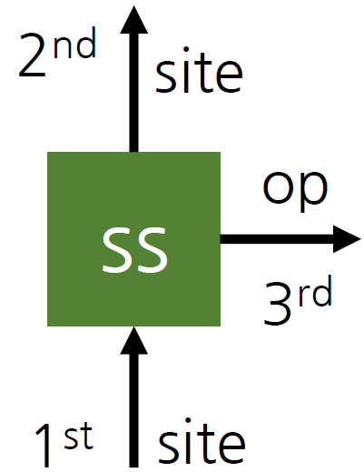
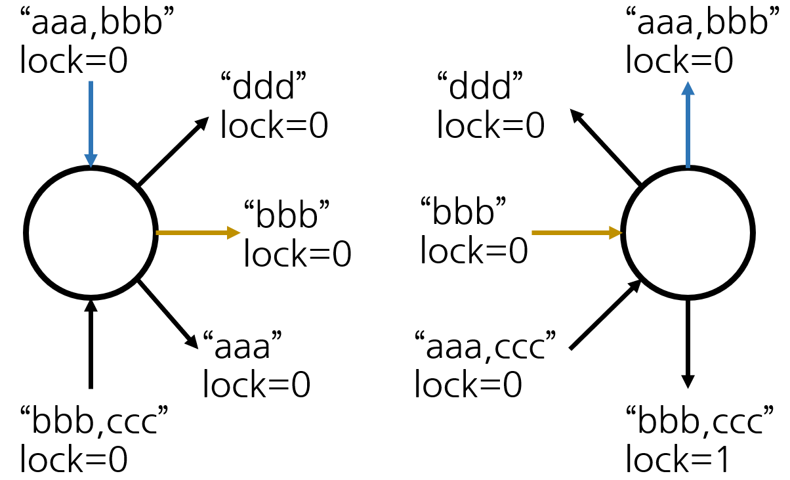
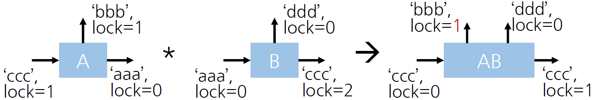

# Introduction and installation

## About Telum.jl

Telum.jl is a non-Abelian symmetric tensor network library fully written in Julia. Currently, it supports fermionic systems with U(1), SU(2) charge & spin, and SU(N) channel symmetry. Sp(2N) and SO(N) channel symmetry, and a general spin system, will be supported in the near future.

Telum is the Latin word meaning 'weapon', and it has a backronym, 'TEnsor Library for Universal Many-body simulation.'

Every symmetry-related property is calculated from LurCGT.jl. Of course, users don’t need to understand the internal algorithm of the Clebsch-Gordan backend.

Familiarity with the MATLAB version of QSpace is assumed. The MATLAB version will be called QSpace.m in the rest of the documentation.

Caution

1. The interface of Telum.jl can be changed in the near future.

2. Its performance is not fully optimized yet.

## Installation

You can install the required packages by entering 3 lines. This process does not depend on your OS.

```julia
using Pkg
Pkg.add(url = "https://github.com/ssblee/Telum.jl")
```

The following lightweight example is executed when the page is built:

```@example getting_started
using Telum

qlabeltype((U1, SU{2}))
```

To use Telum.jl, add 3 lines at the beginning of the program.

```@example getting_started
using LurCGT
using Telum
using LinearAlgebra
```

# 2. Defining tensor

Similar to QSpace.m, a tensor can be defined from the getLocalSpace function. However, its syntax is slightly different. 

1. Define the 'option' object. It contains all the necessary information about the target system.
2. Call getLocalSpace on the option object.

The resulting TLArray (TeLum Array) objects are often referred to as 'tensors'.

The code below creates local operators on the single SU(2) spin 1/2 site.

```@example getting_started
# First argument: symmetry type, also :U1 is supported
# Second argument: 2S
option = SpinOptions(:SU2, 1);
q = getLocalSpace(option);
```

For the spin system, two local operators (I: identity, S: spin IROP) are available.

```@example getting_started
q.I
```

Output:

```text
2D TLArray, 1 symmetries [SU2]  ["+", "-"]
  1.	1x1	| 2x2	[ 1 ; 1 ]	1.000000	√2
```

```@example getting_started
q.S
```

Output:

```text
3D TLArray, 1 symmetries [SU2]  ["+", "-", "-"]
  1.	1x1x1	| 2x2x3	[ 1 ; 1 ; 2 ]	1.224745
```

Here is a more complex example, a 3-channel spinful fermionic site with U1 charge, SU2 spin, and SU3 channel symmetry. For a spinful fermionic system, there are two more local operators (Z: fermionic parity, F: fermion annihilation IROP).

```@example getting_started
# Arguments for FermionSOptions: # of channels, charge, spin, channel
option = FermionSOptions(3, :U1, :SU2, :SU3);
q = getLocalSpace(option);
```

Here, 64 (=4^3) dimensional local space is split into 10 symmetry sectors. The quantum number convention is identical to QSpace.m. Three q-labels are for total charge (relative to half-filled), spin (2S), and SU(3) channel symmetry. For example, the symmetry sector (2, 1, 01) is spanned by $c_{1\uparrow}|6\rangle, c_{1\downarrow}|6\rangle, \cdots, c_{3\downarrow}|6\rangle$ where $|6\rangle=c^{\dagger}_{1\uparrow}c^{\dagger}_{1\downarrow}c^{\dagger}_{2\uparrow}c^{\dagger}_{2\downarrow}c^{\dagger}_{3\uparrow}c^{\dagger}_{3\downarrow}|0\rangle$

```@example getting_started
q.Z
```

Output:

```text
2D TLArray, 3 symmetries [U1, SU2, SU3]  ["+", "-"]
  1.	1x1	| 1x1	1x1	[ -3 0 00 ; -3 0 00 ]	 1.000000	√1
  2.	1x1	| 2x2	3x3	[ -2 1 10 ; -2 1 10 ]	-1.000000	√6
  3.	1x1	| 1x1	6x6	[ -1 0 20 ; -1 0 20 ]	 1.000000	√6
  4.	1x1	| 3x3	3x3	[ -1 2 01 ; -1 2 01 ]	 1.000000	√9
  5.	1x1	| 2x2	8x8	[  0 1 11 ;  0 1 11 ]	-1.000000	√16
  6.	1x1	| 4x4	1x1	[  0 3 00 ;  0 3 00 ]	-1.000000	√4
  7.	1x1	| 1x1	6x6	[  1 0 02 ;  1 0 02 ]	 1.000000	√6
  8.	1x1	| 3x3	3x3	[  1 2 10 ;  1 2 10 ]	 1.000000	√9
  9.	1x1	| 2x2	3x3	[  2 1 01 ;  2 1 01 ]	-1.000000	√6
  10.	1x1	| 1x1	1x1	[  3 0 00 ;  3 0 00 ]	 1.000000	√1
```

Since there is SU(3) channel symmetry, the resulting IROP F is the sum of annihilation operators for 3 channels. Through the function 'keys', you can access the available IROPs in getLocalSpace.

```@example getting_started
keys(q)
```

Output:

```text
(:Z, :I, :F, :S)
```

```@example getting_started
q.F
```

Output:

```text
3D TLArray, 3 symmetries [U1, SU2, SU3]  ["+", "-", "-"]
  1.	1x1x1	| 1x2x2	1x3x3	[ -3 0 00 ; -2 1 10 ; -1 1 01 ]	 2.449490
  2.	1x1x1	| 2x1x2	3x6x3	[ -2 1 10 ; -1 0 20 ; -1 1 01 ]	-3.464102
  3.	1x1x1	| 2x3x2	3x3x3	[ -2 1 10 ; -1 2 01 ; -1 1 01 ]	-4.242641
  4.	1x1x1	| 1x2x2	6x8x3	[ -1 0 20 ;  0 1 11 ; -1 1 01 ]	 4.898979
  5.	1x1x1	| 3x2x2	3x8x3	[ -1 2 01 ;  0 1 11 ; -1 1 01 ]	-4.898979

  ⋮  (2 sectors omitted)
  8.	1x1x1	| 2x3x2	8x3x3	[  0 1 11 ;  1 2 10 ; -1 1 01 ]	 4.898979
  9.	1x1x1	| 4x3x2	1x3x3	[  0 3 00 ;  1 2 10 ; -1 1 01 ]	-3.464102
  10.	1x1x1	| 1x2x2	6x3x3	[  1 0 02 ;  2 1 01 ; -1 1 01 ]	 3.464102
  11.	1x1x1	| 3x2x2	3x3x3	[  1 2 10 ;  2 1 01 ; -1 1 01 ]	 4.242641
  12.	1x1x1	| 2x1x2	3x1x3	[  2 1 01 ;  3 0 00 ; -1 1 01 ]	-2.449490
```

```@example getting_started
q.S
```

Output:

```text
3D TLArray, 1 symmetries [SU2]  ["+", "-", "-"]
  1.	1x1x1	| 2x2x3	[ 1 ; 1 ; 2 ]	1.224745
```

The itags can be added as follows. You don't need to put '*' at the end.

```@example getting_started
ss = TLArray(q.S, ("site", "site", "op"))
```

Output:

```text
3D TLArray, 3 symmetries [U1, SU2, SU3]  ["site+", "site-", "op-"]
  1.	1x1x1	| 2x2x3	3x3x1	[ -2 1 10 ; -2 1 10 ;  0 2 00 ]	-2.121320
  2.	1x1x1	| 3x3x3	3x3x1	[ -1 2 01 ; -1 2 01 ;  0 2 00 ]	-4.242641
  3.	1x1x1	| 2x2x3	8x8x1	[  0 1 11 ;  0 1 11 ;  0 2 00 ]	-3.464102
  4.	1x1x1	| 4x4x3	1x1x1	[  0 3 00 ;  0 3 00 ;  0 2 00 ]	 3.872983
  5.	1x1x1	| 3x3x3	3x3x1	[  1 2 10 ;  1 2 10 ;  0 2 00 ]	-4.242641
  6.	1x1x1	| 2x2x3	3x3x1	[  2 1 01 ;  2 1 01 ;  0 2 00 ]	-2.121320
```

Itags can be also added at the getLocalSpace call.

```@example getting_started
qq = getLocalSpace(option, ("lur", "lur", "op"));
qq.S
```

Output:

```text
3D TLArray, 3 symmetries [U1, SU2, SU3]  ["lur+", "lur-", "op-"]
  1.	1x1x1	| 2x2x3	3x3x1	[ -2 1 10 ; -2 1 10 ;  0 2 00 ]	-2.121320
  2.	1x1x1	| 3x3x3	3x3x1	[ -1 2 01 ; -1 2 01 ;  0 2 00 ]	-4.242641
  3.	1x1x1	| 2x2x3	8x8x1	[  0 1 11 ;  0 1 11 ;  0 2 00 ]	-3.464102
  4.	1x1x1	| 4x4x3	1x1x1	[  0 3 00 ;  0 3 00 ;  0 2 00 ]	 3.872983
  5.	1x1x1	| 3x3x3	3x3x1	[  1 2 10 ;  1 2 10 ;  0 2 00 ]	-4.242641
  6.	1x1x1	| 2x2x3	3x3x1	[  2 1 01 ;  2 1 01 ;  0 2 00 ]	-2.121320
```

The leg order and direction convention is identical to QSpace.m. In a pictorial diagram, a leg with an incoming arrow looks like something flows into the tensor, hence denoted '+'.



The itag convention of Telum.jl follows ITensor.jl, which supports multiple words. The first leg is considered to have two words 'site' and 'asdf'. This convention turns out useful when searching for the legs from itag.

Since they are internally sorted, we don't need to worry about their order.

```@example getting_started
ss = TLArray(q.S, ("site,asdf", "site,zxcv", "op"))
```

Output:

```text
3D TLArray, 3 symmetries [U1, SU2, SU3]  ["asdf,site+", "site,zxcv-", "op-"]
  1.	1x1x1	| 2x2x3	3x3x1	[ -2 1 10 ; -2 1 10 ;  0 2 00 ]	-2.121320
  2.	1x1x1	| 3x3x3	3x3x1	[ -1 2 01 ; -1 2 01 ;  0 2 00 ]	-4.242641
  3.	1x1x1	| 2x2x3	8x8x1	[  0 1 11 ;  0 1 11 ;  0 2 00 ]	-3.464102
  4.	1x1x1	| 4x4x3	1x1x1	[  0 3 00 ;  0 3 00 ;  0 2 00 ]	 3.872983
  5.	1x1x1	| 3x3x3	3x3x1	[  1 2 10 ;  1 2 10 ;  0 2 00 ]	-4.242641
  6.	1x1x1	| 2x2x3	3x3x1	[  2 1 01 ;  2 1 01 ;  0 2 00 ]	-2.121320
```

# 3. Contraction & leg manipulation

The multiplication operator ‘*’ is overloaded for contraction.
When calling <span style="color: red;">A * B</span> for two tensors A and B, the <span style="color: red;">pairs of legs (la, lb)</span> that satisfy
1. la comes from tensor A, lb from B
2. Both legs have the <span style="color: red;">same nonempty</span> itags.
3. They have <span style="color: red;">opposite</span> arrow <span style="color: red;">directions</span>
4. They have <span style="color: red;">zero lock</span> level (explained later)
5. Other properties (<span style="color: red;">plev, dual, space list</span>) are the <span style="color: red;">same</span>(explained later)

<span style="color: red;">are contracted</span> to generate a new tensor.

For example, yellow and blue legs are contracted in the figure below.



## Leg manipulation

Telum.jl offers plenty of leg-manipulating functions to set which legs should be contracted. The properties of legs are saved in a TLIndex object, one for each leg.

The 5 fields of the TLIndex object are itag, direction, prime level, lock level, and dual. The last three will be introduced later.

```@example getting_started
function print_index(i::TLIndex)
    println("(itag: $(i.itags), dir: $(i.dir), plev: $(i.plev), lock: $(i.lock), dual: $(i.dual))")
end

println(ss)
print_index(ss.inds[1])
print_index(ss.inds[2])
print_index(ss.inds[3])
```

Output:

```text
3D TLArray, 3 symmetries [U1, SU2, SU3]  ["asdf,site+", "site,zxcv-", "op-"]
  1.	1x1x1	| 2x2x3	3x3x1	[ -2 1 10 ; -2 1 10 ;  0 2 00 ]	-2.121320
  2.	1x1x1	| 3x3x3	3x3x1	[ -1 2 01 ; -1 2 01 ;  0 2 00 ]	-4.242641
  3.	1x1x1	| 2x2x3	8x8x1	[  0 1 11 ;  0 1 11 ;  0 2 00 ]	-3.464102
  4.	1x1x1	| 4x4x3	1x1x1	[  0 3 00 ;  0 3 00 ;  0 2 00 ]	 3.872983
  5.	1x1x1	| 3x3x3	3x3x1	[  1 2 10 ;  1 2 10 ;  0 2 00 ]	-4.242641
  6.	1x1x1	| 2x2x3	3x3x1	[  2 1 01 ;  2 1 01 ;  0 2 00 ]	-2.121320
(itag: asdf,site, dir: +, plev: 0, lock: 0, dual: false)
(itag: site,zxcv, dir: -, plev: 0, lock: 0, dual: false)
(itag: op, dir: -, plev: 0, lock: 0, dual: false)
```

### Lock

You can increase the lock level to avoid contraction. The leg is never contracted if its lock level is not 0.

lock(q::TLArray, i::Int): Increase lock level of ith leg by 1. The first leg is selected in the following example.

The lock level is printed next to the itag with a form "🔒\<lock level\>" if the lock level is nonzero.

```@example getting_started
ss1 = lock(ss, 1)
println(ss1)
```

Output:

```text
3D TLArray, 3 symmetries [U1, SU2, SU3]  ["asdf,site+"🔒1, "site,zxcv-", "op-"]
  1.	1x1x1	| 2x2x3	3x3x1	[ -2 1 10 ; -2 1 10 ;  0 2 00 ]	-2.121320
  2.	1x1x1	| 3x3x3	3x3x1	[ -1 2 01 ; -1 2 01 ;  0 2 00 ]	-4.242641
  3.	1x1x1	| 2x2x3	8x8x1	[  0 1 11 ;  0 1 11 ;  0 2 00 ]	-3.464102
  4.	1x1x1	| 4x4x3	1x1x1	[  0 3 00 ;  0 3 00 ;  0 2 00 ]	 3.872983
  5.	1x1x1	| 3x3x3	3x3x1	[  1 2 10 ;  1 2 10 ;  0 2 00 ]	-4.242641
  6.	1x1x1	| 2x2x3	3x3x1	[  2 1 01 ;  2 1 01 ;  0 2 00 ]	-2.121320
```

The tensors ss and ss1 refer to the same numerical data (w-matrices, RMT). The metadata of the argument ss is never changed.

```@example getting_started
ss
```

Output:

```text
3D TLArray, 3 symmetries [U1, SU2, SU3]  ["asdf,site+", "site,zxcv-", "op-"]
  1.	1x1x1	| 2x2x3	3x3x1	[ -2 1 10 ; -2 1 10 ;  0 2 00 ]	-2.121320
  2.	1x1x1	| 3x3x3	3x3x1	[ -1 2 01 ; -1 2 01 ;  0 2 00 ]	-4.242641
  3.	1x1x1	| 2x2x3	8x8x1	[  0 1 11 ;  0 1 11 ;  0 2 00 ]	-3.464102
  4.	1x1x1	| 4x4x3	1x1x1	[  0 3 00 ;  0 3 00 ;  0 2 00 ]	 3.872983
  5.	1x1x1	| 3x3x3	3x3x1	[  1 2 10 ;  1 2 10 ;  0 2 00 ]	-4.242641
  6.	1x1x1	| 2x2x3	3x3x1	[  2 1 01 ;  2 1 01 ;  0 2 00 ]	-2.121320
```

It can also accept a vector or a tuple of leg indices to lock multiple legs.

```@example getting_started
ss12 = lock(ss, (1, 2)) # Lock 1st & 2nd legs
printmeta(ss12)
```

Output:

```text
3D TLArray, 3 symmetries [U1, SU2, SU3]  ["asdf,site+"🔒1, "site,zxcv-"🔒1, "op-"]
```

Instead of leg indices, we can select legs by their fields. In this example, legs with itag 'site' (1st and 2nd legs) are locked.

```@example getting_started
sst = lock(ss; itag="site")
printmeta(sst)
```

Output:

```text
3D TLArray, 3 symmetries [U1, SU2, SU3]  ["asdf,site+"🔒1, "site,zxcv-"🔒1, "op-"]
```

The argument behind the semicolon is referred to as a keyword argument. Detailed options can be specified through keyword arguments. A list of available keyword arguments will be given later.

By default, the lock level increases by 1. We can change the increment by giving the 'inc' keyword argument.

If you give a tensor only, every leg is locked.

```@example getting_started
sst = lock(ss; itag="op", inc=3);
printmeta(sst)
sss = lock(ss)
printmeta(sss)
```

Output:

```text
3D TLArray, 3 symmetries [U1, SU2, SU3]  ["asdf,site+", "site,zxcv-", "op-"🔒3]
3D TLArray, 3 symmetries [U1, SU2, SU3]  ["asdf,site+"🔒1, "site,zxcv-"🔒1, "op-"🔒1]
```

### Lockp & Unlock

You can use the lockp function for permanent locking. The lock levels of selected legs are fixed to -1, and an explicit unlock call is the only way to 'unlock' the leg.

The unlock function sets the lock level of selected legs to 0.

```@example getting_started
ssp = lockp(ss, (1, 2));
printmeta(ssp)
ssp2 = lock(ssp, 2); # Nothing happens. Lock level is fixed to -1.
printmeta(ssp2)
sspp = unlock(ssp2, (2, 3))
printmeta(sspp)
```

Output:

```text
3D TLArray, 3 symmetries [U1, SU2, SU3]  ["asdf,site+"🔒-1, "site,zxcv-"🔒-1, "op-"]
3D TLArray, 3 symmetries [U1, SU2, SU3]  ["asdf,site+"🔒-1, "site,zxcv-"🔒-1, "op-"]
3D TLArray, 3 symmetries [U1, SU2, SU3]  ["asdf,site+"🔒-1, "site,zxcv-", "op-"]
```

### Lock level in contraction

Suppose we call A * B for two tensors A and B, and the leg l of A is locked(i.e., positive lock level). In the contraction function,

1. If the leg l has a matching leg in B (same itag/plev/dual, opposite direction), its lock level is reduced by 1.
2. Otherwise, its lock level is unchanged.

This applies similarly to the legs of B. Of course, negative lock level (-1 by lockp) is never changed inside the contraction function.

Below is an example. Assume that the legs have the same plev and dual. The lock level of the 'bbb' leg remains the same since there is no matching leg in the tensor B.



### Prime level

It is a non-negative integer associated with each leg. Legs with different prime levels are considered different, so they are never contracted. This is usually used when differentiating ket and bra in ITensors.jl. However, you can skip this since bra and ket are well distinguished by leg direction in Telum.jl. 

Similar to locking, both leg indices and keyword arguments are accepted. 

The prime level is printed next to the itag with a form of "p\<prime level\>" if the prime level is nonzero.

```@example getting_started
printmeta(ss)
printmeta(prime(ss, (1, 3)))
printmeta(prime(ss; itag="site"))
```

Output:

```text
3D TLArray, 3 symmetries [U1, SU2, SU3]  ["asdf,site+", "site,zxcv-", "op-"]
3D TLArray, 3 symmetries [U1, SU2, SU3]  ["asdf,site+"p1, "site,zxcv-", "op-"p1]
3D TLArray, 3 symmetries [U1, SU2, SU3]  ["asdf,site+"p1, "site,zxcv-"p1, "op-"]
```

You can adjust the increment by the keyword argument 'inc'. Although the increment can be negative, the prime level never goes below 0.

```@example getting_started
ssp = prime(ss, (1, 3); inc=3)
printmeta(ssp)
ssp2 = prime(ssp, (1, 2); inc=-2)
printmeta(ssp2)
```

Output:

```text
3D TLArray, 3 symmetries [U1, SU2, SU3]  ["asdf,site+"p3, "site,zxcv-", "op-"p3]
3D TLArray, 3 symmetries [U1, SU2, SU3]  ["asdf,site+"p1, "site,zxcv-", "op-"p3]
```

There are two other prime-related functions, 'setprime' and 'noprime'. The setprime function sets the prime level to the given value, and noprime sets it to 0. Similarly, you can give keyword arguments instead of an explicit list of leg indices.

```@example getting_started
ssp3 = setprime(ssp2, (2, 3), 2) # Set the prime level of the 2nd and 3rd legs to 2
printmeta(ssp3)
ssp4 = noprime(ssp3, 3) # Set the prime level of the 3rd leg to 0
printmeta(ssp4)
ssp5 = noprime(ssp4) # If no leg is specified, set all legs to 0
printmeta(ssp5)
```

Output:

```text
3D TLArray, 3 symmetries [U1, SU2, SU3]  ["asdf,site+"p1, "site,zxcv-"p2, "op-"p2]
3D TLArray, 3 symmetries [U1, SU2, SU3]  ["asdf,site+"p1, "site,zxcv-"p2, "op-"]
3D TLArray, 3 symmetries [U1, SU2, SU3]  ["asdf,site+", "site,zxcv-", "op-"]
```

If no leg is specified, apply the function to every leg.

```@example getting_started
printmeta(prime(ss; inc=3))
printmeta(setprime(ss, 4))
```

Output:

```text
3D TLArray, 3 symmetries [U1, SU2, SU3]  ["asdf,site+"p3, "site,zxcv-"p3, "op-"p3]
3D TLArray, 3 symmetries [U1, SU2, SU3]  ["asdf,site+"p4, "site,zxcv-"p4, "op-"p4]
```

### Change itag

There are many functions to add and remove itags of a given tensor. The first function is additag, which adds itag to the selected legs.

```@example getting_started
printmeta(ss)
printmeta(additag(ss, (1, 2), "nitag"))
# Itag is not duplicated (only "bbb" is added for the 1st leg)
printmeta(additag(ss, "asdf,bbb"; itag="site")) 
printmeta(additag(ss, "ccc")) # Add itag to all legs
```

Output:

```text
3D TLArray, 3 symmetries [U1, SU2, SU3]  ["asdf,site+", "site,zxcv-", "op-"]
3D TLArray, 3 symmetries [U1, SU2, SU3]  ["asdf,nitag,site+", "nitag,site,zxcv-", "op-"]
3D TLArray, 3 symmetries [U1, SU2, SU3]  ["asdf,bbb,site+", "asdf,bbb,site,zxcv-", "op-"]
3D TLArray, 3 symmetries [U1, SU2, SU3]  ["asdf,ccc,site+", "ccc,site,zxcv-", "ccc,op-"]
```

The next function is removeitag. Not only a single string, but this function can also accept a vector or a tuple of strings. If ("aaa,bbb", "ccc") is given, first "aaa" and "bbb" are removed for legs whose itag contains both "aaa" and "bbb". Then "ccc" is removed similarly for legs with itag "ccc".

You can give leg indices or keyword arguments to restrict the change to a part of the legs.

```@example getting_started
printmeta(ss)
printmeta(removeitag(ss, (1, 2), "site"))
printmeta(removeitag(ss, (1, 2), ("asdf", "zxcv")))
printmeta(removeitag(ss, ("zzzz,asdf", "zxcv"); itag="site"))
```

Output:

```text
3D TLArray, 3 symmetries [U1, SU2, SU3]  ["asdf,site+", "site,zxcv-", "op-"]
3D TLArray, 3 symmetries [U1, SU2, SU3]  ["asdf+", "zxcv-", "op-"]
3D TLArray, 3 symmetries [U1, SU2, SU3]  ["site+", "site-", "op-"]
3D TLArray, 3 symmetries [U1, SU2, SU3]  ["asdf,site+", "site-", "op-"]
```

The 'replaceitag' function replaces a given word with another word.

```@example getting_started
printmeta(ss)
printmeta(replaceitag(ss, "site"=>"newtag"))
```

Output:

```text
3D TLArray, 3 symmetries [U1, SU2, SU3]  ["asdf,site+", "site,zxcv-", "op-"]
3D TLArray, 3 symmetries [U1, SU2, SU3]  ["asdf,newtag+", "newtag,zxcv-", "op-"]
```

(...) => (...) is the constructor of the 'Pair' object in Julia. Their elements are accessible from 'first' and 'second'.

```@example getting_started
a = 1 => 2
println(typeof(a))
println(a.first)
println(a.second)
```

Output:

```text
Pair{Int64, Int64}
1
2
```

If the string to be removed contains multiple words, only the legs that contains all are affected.

```@example getting_started
printmeta(ss)
printmeta(replaceitag(ss, "site,asdf"=>"newtag")) # The second leg is not replaced
```

Output:

```text
3D TLArray, 3 symmetries [U1, SU2, SU3]  ["asdf,site+", "site,zxcv-", "op-"]
3D TLArray, 3 symmetries [U1, SU2, SU3]  ["newtag+", "site,zxcv-", "op-"]
```

You can give multiple replacement rules. The code below swaps the itag "asdf" and "zxcv".

```@example getting_started
printmeta(ss)
printmeta(replaceitag(ss, "asdf"=>"zxcv", "zxcv"=>"asdf"))
```

Output:

```text
3D TLArray, 3 symmetries [U1, SU2, SU3]  ["asdf,site+", "site,zxcv-", "op-"]
3D TLArray, 3 symmetries [U1, SU2, SU3]  ["site,zxcv+", "asdf,site-", "op-"]
```

The detailed explanation of how the replacements act on the first leg "site,asdf" is:

1. Define new itag as an empty string. old="site,asdf", new=""

2. First replacement rule. Find "asdf" in the old itag. If so, remove it from the old itag and add "zxcv" to the new itag. old="site", new="zxcv"

3. Second replacement. Find "zxcv" and do a similar thing. Here, nothing happens.

4. Move the remaining 'old' itag to the new itag and return the new one. old="", new="site,zxcv"

The itag is processed in the order in which it comes in as an argument.

We can give a dictionary with String keys and values. In this case, the order of rule application is not defined. Here is an example of changing every number n <= 100 to n+1.

```@example getting_started
dict = Dict("$i" => "$(i+1)" for i in 1:100)
ssn = TLArray(q.S, ("24,46", "site,25", "op,63"))
printmeta(replaceitag(ssn, dict))
```

Output:

```text
3D TLArray, 3 symmetries [U1, SU2, SU3]  ["25,47+", "26,site-", "64,op-"]
```

For both versions, we can restrict the affected leg by keyword arguments.

```@example getting_started
ssn = TLArray(q.S, ("24,46", "site,25", "op,63"))
printmeta(replaceitag(ssn, dict; dir='-')) # Only replace 2nd and 3rd legs
```

Output:

```text
3D TLArray, 3 symmetries [U1, SU2, SU3]  ["24,46+", "26,site-", "64,op-"]
```

The last one is setitag. This sets the itag of selected legs to the given string.

```@example getting_started
printmeta(ss)
printmeta(setitag(ss, (1, 2), "lur"))
printmeta(setitag(ss, "lur"; itag="site"))
```

Output:

```text
3D TLArray, 3 symmetries [U1, SU2, SU3]  ["asdf,site+", "site,zxcv-", "op-"]
3D TLArray, 3 symmetries [U1, SU2, SU3]  ["lur+", "lur-", "op-"]
3D TLArray, 3 symmetries [U1, SU2, SU3]  ["lur+", "lur-", "op-"]
```

### Tensor product

Sometimes you intend to perform a contraction, but the tensor product is performed due to your mistake when manipulating the legs. Then, the program can die silently.

```@example getting_started
# Example: You intended to contract F and Z
qs = TLArray(q.S, ("bbbb", "bbbb", "op"))
qz = TLArray(q.Z, ("bbbbb", "cccc")); # But you made a typo in the first leg

# qs * qz in this situation will generate a rank-5 tensor. More severe things can happen for large computations.
```

Output:

```text
2D TLArray, 3 symmetries [U1, SU2, SU3]  ["bbbbb+", "cccc-"]
  1.	1x1	| 1x1	1x1	[ -3 0 00 ; -3 0 00 ]	 1.000000	√1
  2.	1x1	| 2x2	3x3	[ -2 1 10 ; -2 1 10 ]	-1.000000	√6
  3.	1x1	| 1x1	6x6	[ -1 0 20 ; -1 0 20 ]	 1.000000	√6
  4.	1x1	| 3x3	3x3	[ -1 2 01 ; -1 2 01 ]	 1.000000	√9
  5.	1x1	| 2x2	8x8	[  0 1 11 ;  0 1 11 ]	-1.000000	√16
  6.	1x1	| 4x4	1x1	[  0 3 00 ;  0 3 00 ]	-1.000000	√4
  7.	1x1	| 1x1	6x6	[  1 0 02 ;  1 0 02 ]	 1.000000	√6
  8.	1x1	| 3x3	3x3	[  1 2 10 ;  1 2 10 ]	 1.000000	√9
  9.	1x1	| 2x2	3x3	[  2 1 01 ;  2 1 01 ]	-1.000000	√6
  10.	1x1	| 1x1	1x1	[  3 0 00 ;  3 0 00 ]	 1.000000	√1
```

For users to notice it quickly, the contraction function returns an error when the contracted pair is not found.

```@example getting_started
qs * qz
```

Output:

```text
AssertionError: No matching contractible indices found between the two TLArray objects
```

If you intended a tensor product, use ⊗ operator instead. To enter the operator symbol, enter '\otimes' and the tab key in the REPL, code editor with Julia extension.

```@example getting_started
printmeta(ss)
ii = TLArray(q.I, ("lur", "lur"))  
printmeta(ii)
ss ⊗ ii # It can take long time
```

Output:

```text
3D TLArray, 3 symmetries [U1, SU2, SU3]  ["asdf,site+", "site,zxcv-", "op-"]
2D TLArray, 3 symmetries [U1, SU2, SU3]  ["lur+", "lur-"]
5D TLArray, 3 symmetries [U1, SU2, SU3]  ["asdf,site+", "site,zxcv-", "op-", "lur+", "lur-"]
  1.	1x1x1x1x1	| 2x2x3x1x1	3x3x1x1x1	[ -2 1 10 ; -2 1 10 ;  0 2 00 ; -3 0 00 ; -3 0 00 ]	-2.121320
  2.	1x1x1x1x1	| 2x2x3x2x2	3x3x1x3x3	[ -2 1 10 ; -2 1 10 ;  0 2 00 ; -2 1 10 ; -2 1 10 ]	 5.196152
  3.	1x1x1x1x1	| 2x2x3x1x1	3x3x1x6x6	[ -2 1 10 ; -2 1 10 ;  0 2 00 ; -1 0 20 ; -1 0 20 ]	 5.196152
  4.	1x1x1x1x1	| 2x2x3x3x3	3x3x1x3x3	[ -2 1 10 ; -2 1 10 ;  0 2 00 ; -1 2 01 ; -1 2 01 ]	-6.363961
  5.	1x1x1x1x1	| 2x2x3x2x2	3x3x1x8x8	[ -2 1 10 ; -2 1 10 ;  0 2 00 ;  0 1 11 ;  0 1 11 ]	 8.485281

  ⋮  (50 sectors omitted)
  56.	1x1x1x1x1	| 2x2x3x4x4	3x3x1x1x1	[  2 1 01 ;  2 1 01 ;  0 2 00 ;  0 3 00 ;  0 3 00 ]	 4.242641
  57.	1x1x1x1x1	| 2x2x3x1x1	3x3x1x6x6	[  2 1 01 ;  2 1 01 ;  0 2 00 ;  1 0 02 ;  1 0 02 ]	 5.196152
  58.	1x1x1x1x1	| 2x2x3x3x3	3x3x1x3x3	[  2 1 01 ;  2 1 01 ;  0 2 00 ;  1 2 10 ;  1 2 10 ]	-6.363961
  59.	1x1x1x1x1	| 2x2x3x2x2	3x3x1x3x3	[  2 1 01 ;  2 1 01 ;  0 2 00 ;  2 1 01 ;  2 1 01 ]	 5.196152
  60.	1x1x1x1x1	| 2x2x3x1x1	3x3x1x1x1	[  2 1 01 ;  2 1 01 ;  0 2 00 ;  3 0 00 ;  3 0 00 ]	-2.121320
```

Not to introduce ambiguity when contracting, an error occurs if the legs with the same properties (except lock level) appear as a result. The code below attempts to change the itag of the second leg to "op", resulting in an error.

```@example getting_started
printmeta(ss)
setitag(ss, "op"; itag="zxcv")
```

Output:

```text
3D TLArray, 3 symmetries [U1, SU2, SU3]  ["asdf,site+", "site,zxcv-", "op-"]
AssertionError: Duplicate TLIndex with non-empty itag in TLArray.inds: TLIndex(op, '-', 0, 0, false)
```

Multiple legs with the same empty itags are allowed since they are never selected in contraction.

```@example getting_started
q.S
```

Output:

```text
3D TLArray, 1 symmetries [SU2]  ["+", "-", "-"]
  1.	1x1x1	| 2x2x3	[ 1 ; 1 ; 2 ]	1.224745
```
