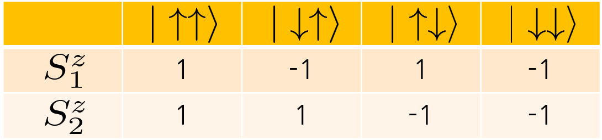
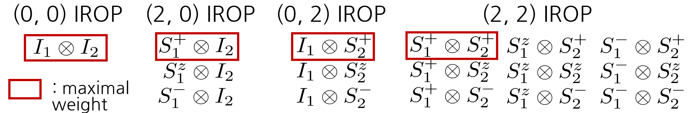

# About getLocalSpace

With the new version of getLocalSpace, you can 

1. Define the system with mixed symmetry (e.g., U1 charge on channel 1, SU2 charge on channel 2)
2. Define a custom space easily.

```@repl local_spaces
using Telum

zero_qlabels((U1, SU{2}, SU{3}))
```

```@repl local_spaces
using LurCGT
using Telum
using LinearAlgebra
```

# System with mixed symmetry

Suppose we want to define a 4-channel spinful fermionic local space with the symmetries

1. U1 charge on channels (1, 2), SU(2) charge on channel 4
2. SU(2) spin on channels (1, 2, 3), U1 spin on channel 4
3. SU(2) channel symmetry on channels (1, 2)

```@repl local_spaces
option = FermionSOptions(4,                               # Number of channels
                         [(:U1, [1, 2]), (:SU2, [4])],    # Charge symmetries
                         [(:SU2, [1, 2, 3]), (:U1, [4])], # Spin symmetries
                         [(:SU2, [1, 2])])

q = getLocalSpace(option);
```

The resulting tensors have 5 symmetries. They are ordered in (charge, spin, channel).

In this example, 10 local operators are defined.

```@repl local_spaces
println(keys(q))
```

Output:

```text
(:S4m, :S123, :Z, :F3, :S4p, :I, :F4u, :F4d, :F12, :S4z)
```

First, I and Z are the identity and fermionic parity operator, respectively.

```@repl local_spaces
q.I
```

Output:

```text
2D TLArray, 5 symmetries [U1, SU2, SU2, U1, SU2]  ["+", "-"]
  1.	2x2	| 1x1	1x1	1x1	[ -2 0 0 -1 0 ; -2 0 0 -1 0 ]	√1
  2.	2x2	| 1x1	1x1	1x1	[ -2 0 0  1 0 ; -2 0 0  1 0 ]	√1
  3.	1x1	| 1x1	2x2	1x1	[ -2 0 1 -1 0 ; -2 0 1 -1 0 ]	1.000000	√2
  4.	1x1	| 1x1	2x2	1x1	[ -2 0 1  1 0 ; -2 0 1  1 0 ]	1.000000	√2
  5.	2x2	| 2x2	1x1	1x1	[ -2 1 0  0 0 ; -2 1 0  0 0 ]	√2

  ⋮  (35 sectors omitted)
  41.	2x2	| 1x1	1x1	1x1	[  2 0 0  1 0 ;  2 0 0  1 0 ]	√1
  42.	1x1	| 1x1	2x2	1x1	[  2 0 1 -1 0 ;  2 0 1 -1 0 ]	1.000000	√2
  43.	1x1	| 1x1	2x2	1x1	[  2 0 1  1 0 ;  2 0 1  1 0 ]	1.000000	√2
  44.	2x2	| 2x2	1x1	1x1	[  2 1 0  0 0 ;  2 1 0  0 0 ]	√2
  45.	1x1	| 2x2	2x2	1x1	[  2 1 1  0 0 ;  2 1 1  0 0 ]	1.000000	√4
```

The symmetries of the system are
1. U1 charge channels (1, 2), SU(2) charge channel 4
2. SU(2) spin for channels (1, 2, 3), U1 spin for channel 4
3. SU(2) channel symmetry for channels (1, 2) 

4 spin operators (S4p, S4z, S4m, S123) are defined. The rules for generating spin operators are shown below.

1. If there is no symmetry, 12 operators (raising/lowering/spin-z for each channel) are defined. They are called S\<channel index\>\<p/m/z\> (S1p, S1m, S1z, ...)
2. For each SU(2) spin symmetry, spin operators for specified channels are fused to generate IROP.

In this example, S123 is the IROP (S1p+S2p+S3p, S1z+S2z+S3z, S1m+S2m+S3m) up to a multiplicative constant.

```@repl local_spaces
q.S123
```

Output:

```text
3D TLArray, 5 symmetries [U1, SU2, SU2, U1, SU2]  ["+", "-", "-"]
  1.	1x1x1	| 1x1x1	2x2x3	1x1x1	[ -2 0 1 -1 0 ; -2 0 1 -1 0 ;  0 0 2  0 0 ]	-1.224745
  2.	1x1x1	| 1x1x1	2x2x3	1x1x1	[ -2 0 1  1 0 ; -2 0 1  1 0 ;  0 0 2  0 0 ]	-1.224745
  3.	1x1x1	| 2x2x1	2x2x3	1x1x1	[ -2 1 1  0 0 ; -2 1 1  0 0 ;  0 0 2  0 0 ]	-1.732051
  4.	2x2x1	| 1x1x1	2x2x3	2x2x1	[ -1 0 1 -1 1 ; -1 0 1 -1 1 ;  0 0 2  0 0 ]
  5.	2x2x1	| 1x1x1	2x2x3	2x2x1	[ -1 0 1  1 1 ; -1 0 1  1 1 ;  0 0 2  0 0 ]

  ⋮  (20 sectors omitted)
  26.	2x2x1	| 2x2x1	2x2x3	2x2x1	[  1 1 1  0 1 ;  1 1 1  0 1 ;  0 0 2  0 0 ]
  27.	1x1x1	| 2x2x1	3x3x3	2x2x1	[  1 1 2  0 1 ;  1 1 2  0 1 ;  0 0 2  0 0 ]	-4.898979
  28.	1x1x1	| 1x1x1	2x2x3	1x1x1	[  2 0 1 -1 0 ;  2 0 1 -1 0 ;  0 0 2  0 0 ]	-1.224745
  29.	1x1x1	| 1x1x1	2x2x3	1x1x1	[  2 0 1  1 0 ;  2 0 1  1 0 ;  0 0 2  0 0 ]	-1.224745
  30.	1x1x1	| 2x2x1	2x2x3	1x1x1	[  2 1 1  0 0 ;  2 1 1  0 0 ;  0 0 2  0 0 ]	-1.732051
```

If all spin operators are fused to the unique IROP, the name is fixed to 'S'.

```@repl local_spaces
option_3 = FermionSOptions(3, :U1, :SU2, :SU3)
# The above code is the shortcut for :
option_3 = FermionSOptions(3,                               # Number of channels
                           [(:U1, [1, 2, 3])],              # Charge symmetries
                           [(:SU2, [1, 2, 3])],             # Spin symmetries
                           [(:SU3, [1, 2, 3])])             # Channel symmetries
q_3 = getLocalSpace(option_3)
keys(q_3) # Unique spin operator, so its name is not 'S123'
```

Output:

```text
(:Z, :I, :F, :S)
```

The symmetries of the system are
1. U1 charge channels (1, 2), SU(2) charge channel 4
2. SU(2) spin for channels (1, 2, 3), U1 spin for channel 4
3. SU(2) channel symmetry for channels (1, 2)

4 fermionic annihilation operators (F12, F3, F4u, F4d) are defined. The rules for generating annihilation operators are shown below.

1. If there is no symmetry, 8 operators (spin up/down annihilation for each channel) are defined.
2. From U1 charge on channels (1, 2), F1u+F2u becomes new operator F12u. Similar for F12d.
3. From SU2 spin symmetry on channels (1, 2, 3), F12u and F12d are fused into IROP F12.

```@repl local_spaces
q.F12
```

Output:

```text
3D TLArray, 5 symmetries [U1, SU2, SU2, U1, SU2]  ["+", "-", "-"]
  1.	2x2x1	| 1x1x1	1x2x2	1x2x2	[ -2 0 0 -1 0 ; -1 0 1 -1 1 ; -1 0 1  0 1 ]
  2.	2x2x1	| 1x1x1	1x2x2	1x2x2	[ -2 0 0  1 0 ; -1 0 1  1 1 ; -1 0 1  0 1 ]
  3.	1x1x1	| 1x1x1	2x1x2	1x2x2	[ -2 0 1 -1 0 ; -1 0 0 -1 1 ; -1 0 1  0 1 ]	-1.414214
  4.	1x1x1	| 1x1x1	2x3x2	1x2x2	[ -2 0 1 -1 0 ; -1 0 2 -1 1 ; -1 0 1  0 1 ]	 2.449490
  5.	1x1x1	| 1x1x1	2x1x2	1x2x2	[ -2 0 1  1 0 ; -1 0 0  1 1 ; -1 0 1  0 1 ]	-1.414214

  ⋮  (50 sectors omitted)
  56.	1x1x1	| 1x1x1	3x2x2	2x1x2	[  1 0 2 -1 1 ;  2 0 1 -1 0 ; -1 0 1  0 1 ]	-2.449490
  57.	1x1x1	| 1x1x1	3x2x2	2x1x2	[  1 0 2  1 1 ;  2 0 1  1 0 ; -1 0 1  0 1 ]	-2.449490
  58.	1x1x1	| 2x2x1	1x2x2	2x1x2	[  1 1 0  0 1 ;  2 1 1  0 0 ; -1 0 1  0 1 ]	 2.000000
  59.	2x2x1	| 2x2x1	2x1x2	2x1x2	[  1 1 1  0 1 ;  2 1 0  0 0 ; -1 0 1  0 1 ]
  60.	1x1x1	| 2x2x1	3x2x2	2x1x2	[  1 1 2  0 1 ;  2 1 1  0 0 ; -1 0 1  0 1 ]	-3.464102
```

4. From SU2 spin, F3u and F3d are also fused into F3.

```@repl local_spaces
q.F3
```

Output:

```text
3D TLArray, 5 symmetries [U1, SU2, SU2, U1, SU2]  ["+", "-", "-"]
  1.	2x1x1	| 1x1x1	1x2x2	1x1x1	[ -2 0 0 -1 0 ; -2 0 1 -1 0 ;  0 0 1  0 0 ]
  2.	2x1x1	| 1x1x1	1x2x2	1x1x1	[ -2 0 0  1 0 ; -2 0 1  1 0 ;  0 0 1  0 0 ]
  3.	1x2x1	| 1x1x1	2x1x2	1x1x1	[ -2 0 1 -1 0 ; -2 0 0 -1 0 ;  0 0 1  0 0 ]
  4.	1x2x1	| 1x1x1	2x1x2	1x1x1	[ -2 0 1  1 0 ; -2 0 0  1 0 ;  0 0 1  0 0 ]
  5.	2x1x1	| 2x2x1	1x2x2	1x1x1	[ -2 1 0  0 0 ; -2 1 1  0 0 ;  0 0 1  0 0 ]

  ⋮  (44 sectors omitted)
  50.	2x1x1	| 1x1x1	1x2x2	1x1x1	[  2 0 0  1 0 ;  2 0 1  1 0 ;  0 0 1  0 0 ]
  51.	1x2x1	| 1x1x1	2x1x2	1x1x1	[  2 0 1 -1 0 ;  2 0 0 -1 0 ;  0 0 1  0 0 ]
  52.	1x2x1	| 1x1x1	2x1x2	1x1x1	[  2 0 1  1 0 ;  2 0 0  1 0 ;  0 0 1  0 0 ]
  53.	2x1x1	| 2x2x1	1x2x2	1x1x1	[  2 1 0  0 0 ;  2 1 1  0 0 ;  0 0 1  0 0 ]
  54.	1x2x1	| 2x2x1	2x1x2	1x1x1	[  2 1 1  0 0 ;  2 1 0  0 0 ;  0 0 1  0 0 ]
```

5. From SU2 charge on channel 4, F4u evolves to (spin down creation, spin up annihilation) on channel 4. Similar to F4d.

```@repl local_spaces
q.F4u
```

Output:

```text
3D TLArray, 5 symmetries [U1, SU2, SU2, U1, SU2]  ["+", "-", "-"]
  1.	2x2x1	| 1x2x2	1x1x1	1x1x1	[ -2 0 0 -1 0 ; -2 1 0  0 0 ;  0 1 0 -1 0 ]
  2.	1x1x1	| 1x2x2	2x2x1	1x1x1	[ -2 0 1 -1 0 ; -2 1 1  0 0 ;  0 1 0 -1 0 ]	 2.000000
  3.	2x2x1	| 2x1x2	1x1x1	1x1x1	[ -2 1 0  0 0 ; -2 0 0  1 0 ;  0 1 0 -1 0 ]
  4.	1x1x1	| 2x1x2	2x2x1	1x1x1	[ -2 1 1  0 0 ; -2 0 1  1 0 ;  0 1 0 -1 0 ]	 2.000000
  5.	1x1x1	| 1x2x2	1x1x1	2x2x1	[ -1 0 0 -1 1 ; -1 1 0  0 1 ;  0 1 0 -1 0 ]	-2.000000

  ⋮  (20 sectors omitted)
  26.	1x1x1	| 2x1x2	3x3x1	2x2x1	[  1 1 2  0 1 ;  1 0 2  1 1 ;  0 1 0 -1 0 ]	-3.464102
  27.	2x2x1	| 1x2x2	1x1x1	1x1x1	[  2 0 0 -1 0 ;  2 1 0  0 0 ;  0 1 0 -1 0 ]
  28.	1x1x1	| 1x2x2	2x2x1	1x1x1	[  2 0 1 -1 0 ;  2 1 1  0 0 ;  0 1 0 -1 0 ]	 2.000000
  29.	2x2x1	| 2x1x2	1x1x1	1x1x1	[  2 1 0  0 0 ;  2 0 0  1 0 ;  0 1 0 -1 0 ]
  30.	1x1x1	| 2x1x2	2x2x1	1x1x1	[  2 1 1  0 0 ;  2 0 1  1 0 ;  0 1 0 -1 0 ]	 2.000000
```

Local IROPs are defined unless the symmetry operators do not commute. Experiment with yourself if confused.

# User-defined space

The following is the only information needed for a user-defined local space.

1. List of symmetries and corresponding quantum numbers.

2. Lowering operators for each symmetry. It doesn't exist for non-Abelian symmetry.

3. 'Maximal weight IROP' for each local operator.

Let's look at an example of a local space with two independent spin-1/2's. This system has 4 states $\{|\uparrow\uparrow\rangle, |\downarrow\uparrow\rangle, |\uparrow\downarrow\rangle, |\downarrow\downarrow\rangle \}$ with symmetry $\mathrm{SU}(2)_1 × \mathrm{SU}(2)_2$.

First, define a new 'Option' type. You can name it whatever you want. Just declare that it is the subtype of 'LocalSpaceOptions' defined in Telum.jl

Currently, this type has no field. It can be added if more flexibility is needed.

```@repl local_spaces
struct lurspace <: LocalSpaceOptions # This means that the new type 'lurspace' is a subtype of 'LocalSpaceOoptions'.
end
```

Only overloading the function 'getSymmetryInfo' is required for custom local space definition. This function receives the option object and returns 3 things above.

First, let's get the quantum number for each symmetry. With the basis ordering $\{|\uparrow\uparrow\rangle, |\downarrow\uparrow\rangle, |\uparrow\downarrow\rangle, |\downarrow\downarrow\rangle \}$,



```@repl local_spaces
function lurspace_qnums()
    return ([(1,), (-1,), (1,), (-1,)], # The quantum numbers for the first symmetry 
            [(1,), (1,), (-1,), (-1,)]) # The quantum numbers for the second symmetry 
end
```

Output:

```text
lurspace_qnums (generic function with 1 method)
```

The spin quantum number is represented as $2S_z$. `(1,)` is Julia syntax for a
one-element tuple; without the comma, `1` is an integer instead.

From Julia syntax, the function can also be defined as follows:

```@repl local_spaces
lurspace_qnums() = ([(1,), (-1,), (1,), (-1,)], # The quantum numbers for the first symmetry 
                    [(1,), (1,), (-1,), (-1,)]) # The quantum numbers for the second symmetry
```

Output:

```text
lurspace_qnums (generic function with 1 method)
```

The next step is to define the lowering operators of two $\mathrm{SU}(2)$ symmetries. Basis is $\{|\uparrow\uparrow\rangle, |\downarrow\uparrow\rangle, |\uparrow\downarrow\rangle, |\downarrow\downarrow\rangle \}$.

```@repl local_spaces
s1dn = [0 0 0 0;
        1 0 0 0;
        0 0 0 0;
        0 0 1 0]

s2dn = [0 0 0 0;
        0 0 0 0;
        1 0 0 0;
        0 1 0 0]

lurspace_dnops() = ([s1dn], [s2dn])
```

Output:

```text
lurspace_dnops (generic function with 1 method)
```

[s1dn] ([s2dn]) is the list of lowering operators for the first (second) $\mathrm{SU}(2)$. For general non-Abelian symmetry, more operators can be placed inside the vector.

Use a sparse matrix when the local space is large.

```@repl local_spaces
using SparseArrays
sparse(s1dn)
```

Output:

```text
4×4 SparseMatrixCSC{Int64, Int64} with 2 stored entries:
 ⋅  ⋅  ⋅  ⋅
 1  ⋅  ⋅  ⋅
 ⋅  ⋅  ⋅  ⋅
 ⋅  ⋅  1  ⋅
```

The last step is to define a dictionary of IROPs. 4 IROPs can be defined, and their list is shown below (up to the scalar constant)

In matrix form,



```@repl local_spaces
mwIROP_00 = [1 0 0 0;
             0 1 0 0;
             0 0 1 0;
             0 0 0 1]

mwIROP_20 = [0 1 0 0;
             0 0 0 0;
             0 0 0 1;
             0 0 0 0]

mwIROP_02 = [0 0 1 0;
             0 0 0 1;
             0 0 0 0;
             0 0 0 0]

mwIROP_22 = [0 0 0 1;
             0 0 0 0;
             0 0 0 0;
             0 0 0 0]
```

Output:

```text
4×4 Matrix{Int64}:
 0  0  0  1
 0  0  0  0
 0  0  0  0
 0  0  0  0
```

Define a dictionary of maximal-weight IROPs.

1. key: Symbol object. The name of the local IROP (e.g., F, S, Z, I for spinful fermionic site)
2. value: Corresponding maximal weight IROP

You may choose any IROP name. The scalar prefactors above define the
normalization convention for this local space.

Telum computes the remaining operators in each IROP from repeated commutators
of the lowering operator with the maximal-weight operator.

```@repl local_spaces
lurspace_mwIROP() = Dict(:I => mwIROP_00,
                         :S1 => -(1/sqrt(2)) * mwIROP_20,
                         :S2 => -(1/sqrt(2)) * mwIROP_02,
                         :Sasdfasdf => mwIROP_22)
```

Output:

```text
lurspace_mwIROP (generic function with 1 method)
```

The last step is to define the 'lurspace' version of getSymmetryInfo. This function will be called inside the getLocalSpace.

```@repl local_spaces
Telum.getSymmetryInfo(::lurspace) = (SU{2}, SU{2}), lurspace_qnums(), lurspace_dnops(), lurspace_mwIROP()
```

Then, just get the local space operator as usual.

If the IROP contains only one operator(q.I in this case), the operator leg is automatically removed.

```@repl local_spaces
option = lurspace()
q = getLocalSpace(option)
println("I: ", q.I)
println()
println("S1: ", q.S1)
println()
println("S2: ", q.S2)
println()
println("Sasdfasdf: ", q.Sasdfasdf)
```

Output:

```text
I: 2D TLArray, 2 symmetries [SU2, SU2]  ["+", "-"]
  1.	1x1	| 2x2	2x2	[ 1 1 ; 1 1 ]	1.000000	√4

S1: 3D TLArray, 2 symmetries [SU2, SU2]  ["+", "-", "-"]
  1.	1x1x1	| 2x2x3	2x2x1	[ 1 1 ; 1 1 ; 2 0 ]	1.732051

S2: 3D TLArray, 2 symmetries [SU2, SU2]  ["+", "-", "-"]
  1.	1x1x1	| 2x2x1	2x2x3	[ 1 1 ; 1 1 ; 0 2 ]	1.732051

Sasdfasdf: 3D TLArray, 2 symmetries [SU2, SU2]  ["+", "-", "-"]
  1.	1x1x1	| 2x2x3	2x2x3	[ 1 1 ; 1 1 ; 2 2 ]	3.000000
```
