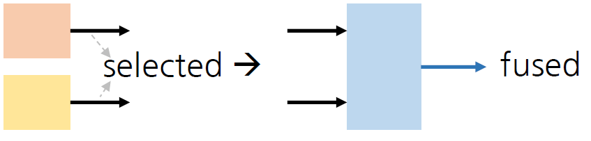
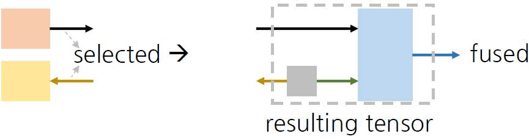
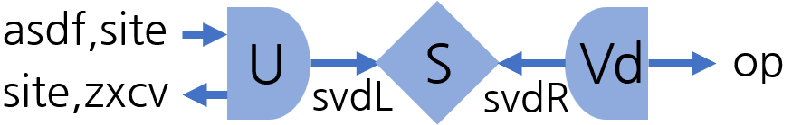
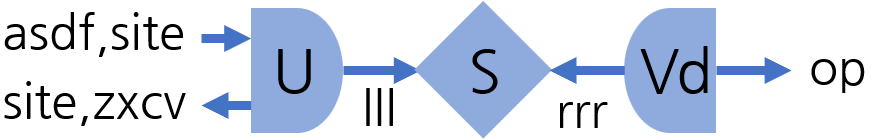
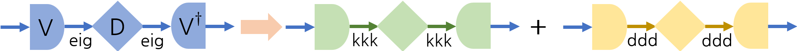
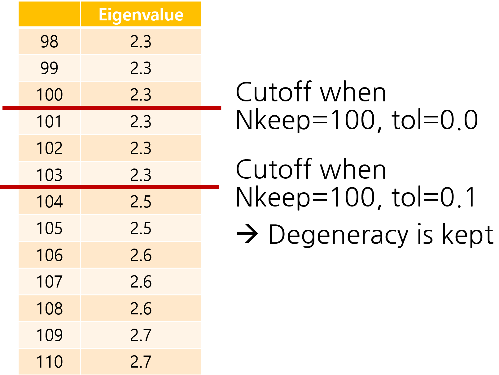

# Tensor operations

To perform a tensor network calculation, defining tensors and contracting them are not sufficient. Many functions are available to implement existing tensor network algorithms.

Before showing methods, I'll introduce one noteworthy difference between QSpace.m and Telum.jl.

```@example tensor_operations
using Telum

zero_qlabels((U1, SU{2}))
```

```@example tensor_operations
using LurCGT
using Telum
using LinearAlgebra

option = FermionSOptions(3, :U1, :SU2, :SU3);
q = getLocalSpace(option);
```

# Space list

One of the biggest differences from QSpace.m

Each leg of the tensor contains an explicit list of spaces and multiplicities. The contraction occurs only when the space lists match.

It seems too restrictive at first sight, but it turns out useful in the eigen and oplus functions.

```@example tensor_operations
q.I
```

Output:

```text
2D TLArray, 3 symmetries [U1, SU2, SU3]  ["+", "-"]
  1.	1x1	| 1x1	1x1	[ -3 0 00 ; -3 0 00 ]	1.000000	√1
  2.	1x1	| 2x2	3x3	[ -2 1 10 ; -2 1 10 ]	1.000000	√6
  3.	1x1	| 1x1	6x6	[ -1 0 20 ; -1 0 20 ]	1.000000	√6
  4.	1x1	| 3x3	3x3	[ -1 2 01 ; -1 2 01 ]	1.000000	√9
  5.	1x1	| 2x2	8x8	[  0 1 11 ;  0 1 11 ]	1.000000	√16
  6.	1x1	| 4x4	1x1	[  0 3 00 ;  0 3 00 ]	1.000000	√4
  7.	1x1	| 1x1	6x6	[  1 0 02 ;  1 0 02 ]	1.000000	√6
  8.	1x1	| 3x3	3x3	[  1 2 10 ;  1 2 10 ]	1.000000	√9
  9.	1x1	| 2x2	3x3	[  2 1 01 ;  2 1 01 ]	1.000000	√6
  10.	1x1	| 1x1	1x1	[  3 0 00 ;  3 0 00 ]	1.000000	√1
```

Here is an example of a 3-channel spinful fermionic system. As I mentioned in the last file, the 64-dimensional local space is divided into 10 symmetry sectors. The code below prints a space list of the first leg of q.I. 

We can see 10 symmetry sectors. For each tuple, the first entry is q-labels and the second integer is its multiplicity (=corresponding size of RMT).

```@example tensor_operations
q.I.spaces[1]
```

Output:

```text
10-element Vector{Tuple{Tuple{Tuple{Int64}, Tuple{Int64}, Tuple{Int64, Int64}}, Int64}}:
 (((-3,), (0,), (0, 0)), 1)
 (((-2,), (1,), (1, 0)), 1)
 (((-1,), (0,), (2, 0)), 1)
 (((-1,), (2,), (0, 1)), 1)
 (((0,), (1,), (1, 1)), 1)
 (((0,), (3,), (0, 0)), 1)
 (((1,), (0,), (0, 2)), 1)
 (((1,), (2,), (1, 0)), 1)
 (((2,), (1,), (0, 1)), 1)
 (((3,), (0,), (0, 0)), 1)
```

For spin IROP, nonzero matrix elements appear in only the part of 10 sectors. However, all 10 sectors are recorded in the space lists.

```@example tensor_operations
println(q.S)
q.S.spaces[1]
```

Output:

```text
3D TLArray, 3 symmetries [U1, SU2, SU3]  ["+", "-", "-"]
  1.	1x1x1	| 2x2x3	3x3x1	[ -2 1 10 ; -2 1 10 ;  0 2 00 ]	-2.121320
  2.	1x1x1	| 3x3x3	3x3x1	[ -1 2 01 ; -1 2 01 ;  0 2 00 ]	-4.242641
  3.	1x1x1	| 2x2x3	8x8x1	[  0 1 11 ;  0 1 11 ;  0 2 00 ]	-3.464102
  4.	1x1x1	| 4x4x3	1x1x1	[  0 3 00 ;  0 3 00 ;  0 2 00 ]	 3.872983
  5.	1x1x1	| 3x3x3	3x3x1	[  1 2 10 ;  1 2 10 ;  0 2 00 ]	-4.242641
  6.	1x1x1	| 2x2x3	3x3x1	[  2 1 01 ;  2 1 01 ;  0 2 00 ]	-2.121320
10-element Vector{Tuple{Tuple{Tuple{Int64}, Tuple{Int64}, Tuple{Int64, Int64}}, Int64}}:
 (((-3,), (0,), (0, 0)), 1)
 (((-2,), (1,), (1, 0)), 1)
 (((-1,), (0,), (2, 0)), 1)
 (((-1,), (2,), (0, 1)), 1)
 (((0,), (1,), (1, 1)), 1)
 (((0,), (3,), (0, 0)), 1)
 (((1,), (0,), (0, 2)), 1)
 (((1,), (2,), (1, 0)), 1)
 (((2,), (1,), (0, 1)), 1)
 (((3,), (0,), (0, 0)), 1)
```

Of course, the third leg has only one sector.

```@example tensor_operations
q.S.spaces[3]
```

Output:

```text
1-element Vector{Tuple{Tuple{Tuple{Int64}, Tuple{Int64}, Tuple{Int64, Int64}}, Int64}}:
 (((0,), (2,), (0, 0)), 1)
```

# Conj

Conjugation is very easy in Julia. Just put a quotation mark, then the new tensor with 1) every arrow direction is inverted, and 2) RMT is complex conjugated is constructed.

```@example tensor_operations
ss = TLArray(q.S, ("site,asdf", "site,zxcv", "op"))
printmeta(ss)
printmeta(ss')
```

Output:

```text
3D TLArray, 3 symmetries [U1, SU2, SU3]  ["asdf,site+", "site,zxcv-", "op-"]
3D TLArray, 3 symmetries [U1, SU2, SU3]  ["asdf,site-", "site,zxcv+", "op+"]
```

# get1jtensor

This function is used when inverting the arrow direction. It was part of getIdentity in QSpace.m. 

In this example, the second leg of ss is selected. Like QSpace.m, one of the legs of the result is printed green, which means that dual=true in their index. Two legs of the tensor 'j' are considered different.

One difference is that the full space list of selected legs is considered. Although the input tensor has 6 rows, all 10 sectors contribute to the resulting tensor.

```@example tensor_operations
println(ss)
j = get1jtensor(ss, 2)
println(j)
println(j.inds[1])
println(j.inds[2])
```

Output:

```text
3D TLArray, 3 symmetries [U1, SU2, SU3]  ["asdf,site+", "site,zxcv-", "op-"]
  1.	1x1x1	| 2x2x3	3x3x1	[ -2 1 10 ; -2 1 10 ;  0 2 00 ]	-2.121320
  2.	1x1x1	| 3x3x3	3x3x1	[ -1 2 01 ; -1 2 01 ;  0 2 00 ]	-4.242641
  3.	1x1x1	| 2x2x3	8x8x1	[  0 1 11 ;  0 1 11 ;  0 2 00 ]	-3.464102
  4.	1x1x1	| 4x4x3	1x1x1	[  0 3 00 ;  0 3 00 ;  0 2 00 ]	 3.872983
  5.	1x1x1	| 3x3x3	3x3x1	[  1 2 10 ;  1 2 10 ;  0 2 00 ]	-4.242641
  6.	1x1x1	| 2x2x3	3x3x1	[  2 1 01 ;  2 1 01 ;  0 2 00 ]	-2.121320
2D TLArray, 3 symmetries [U1, SU2, SU3]  ["site,zxcv+", "site,zxcv+"]
  1.	1x1	| 1x1	1x1	[ -3 0 00 ;  3 0 00 ]	1.000000	√1
  2.	1x1	| 2x2	3x3	[ -2 1 10 ;  2 1 01 ]	1.000000	√6
  3.	1x1	| 1x1	6x6	[ -1 0 20 ;  1 0 02 ]	1.000000	√6
  4.	1x1	| 3x3	3x3	[ -1 2 01 ;  1 2 10 ]	1.000000	√9
  5.	1x1	| 2x2	8x8	[  0 1 11 ;  0 1 11 ]	1.000000	√16
  6.	1x1	| 4x4	1x1	[  0 3 00 ;  0 3 00 ]	1.000000	√4
  7.	1x1	| 1x1	6x6	[  1 0 02 ; -1 0 20 ]	1.000000	√6
  8.	1x1	| 3x3	3x3	[  1 2 10 ; -1 2 01 ]	1.000000	√9
  9.	1x1	| 2x2	3x3	[  2 1 01 ; -2 1 10 ]	1.000000	√6
  10.	1x1	| 1x1	1x1	[  3 0 00 ; -3 0 00 ]	1.000000	√1
TLIndex(site,zxcv, '+', 0, 0, false)
TLIndex(site,zxcv, '+', 0, 0, true)
```

Instead of a leg index, you can give a leg by its properties. The arrow direction of the resulting tensor is opposite to the selected leg.

```@example tensor_operations
get1jtensor(ss; itag="zxcv")
```

Output:

```text
2D TLArray, 3 symmetries [U1, SU2, SU3]  ["site,zxcv+", "site,zxcv+"]
  1.	1x1	| 1x1	1x1	[ -3 0 00 ;  3 0 00 ]	1.000000	√1
  2.	1x1	| 2x2	3x3	[ -2 1 10 ;  2 1 01 ]	1.000000	√6
  3.	1x1	| 1x1	6x6	[ -1 0 20 ;  1 0 02 ]	1.000000	√6
  4.	1x1	| 3x3	3x3	[ -1 2 01 ;  1 2 10 ]	1.000000	√9
  5.	1x1	| 2x2	8x8	[  0 1 11 ;  0 1 11 ]	1.000000	√16
  6.	1x1	| 4x4	1x1	[  0 3 00 ;  0 3 00 ]	1.000000	√4
  7.	1x1	| 1x1	6x6	[  1 0 02 ; -1 0 20 ]	1.000000	√6
  8.	1x1	| 3x3	3x3	[  1 2 10 ; -1 2 01 ]	1.000000	√9
  9.	1x1	| 2x2	3x3	[  2 1 01 ; -2 1 10 ]	1.000000	√6
  10.	1x1	| 1x1	1x1	[  3 0 00 ; -3 0 00 ]	1.000000	√1
```

```@example tensor_operations
get1jtensor(ss; itag="asdf")
```

Output:

```text
2D TLArray, 3 symmetries [U1, SU2, SU3]  ["asdf,site-", "asdf,site-"]
  1.	1x1	| 1x1	1x1	[ -3 0 00 ;  3 0 00 ]	1.000000	√1
  2.	1x1	| 2x2	3x3	[ -2 1 10 ;  2 1 01 ]	1.000000	√6
  3.	1x1	| 1x1	6x6	[ -1 0 20 ;  1 0 02 ]	1.000000	√6
  4.	1x1	| 3x3	3x3	[ -1 2 01 ;  1 2 10 ]	1.000000	√9
  5.	1x1	| 2x2	8x8	[  0 1 11 ;  0 1 11 ]	1.000000	√16
  6.	1x1	| 4x4	1x1	[  0 3 00 ;  0 3 00 ]	1.000000	√4
  7.	1x1	| 1x1	6x6	[  1 0 02 ; -1 0 20 ]	1.000000	√6
  8.	1x1	| 3x3	3x3	[  1 2 10 ; -1 2 01 ]	1.000000	√9
  9.	1x1	| 2x2	3x3	[  2 1 01 ; -2 1 10 ]	1.000000	√6
  10.	1x1	| 1x1	1x1	[  3 0 00 ; -3 0 00 ]	1.000000	√1
```

An error occurs when no legs are selected or when there is ambiguity.

```@example tensor_operations
get1jtensor(ss; itag="q")
```

Output:

```text
ArgumentError: get1jtensor requires a uniquely specified leg, but no legs matched
```

```@example tensor_operations
get1jtensor(ss; itag="site")
```

Output:

```text
ArgumentError: get1jtensor requires a uniquely specified leg, but matched legs [1, 2]
```

# legflip

Flip the leg direction of selected leg(s) of a given tensor. Internally, it calls get1jtensor for each leg and contract.

```@example tensor_operations
ss
```

Output:

```text
3D TLArray, 3 symmetries [U1, SU2, SU3]  ["asdf,site+", "site,zxcv-", "op-"]
  1.	1x1x1	| 2x2x3	3x3x1	[ -2 1 10 ; -2 1 10 ;  0 2 00 ]	-2.121320
  2.	1x1x1	| 3x3x3	3x3x1	[ -1 2 01 ; -1 2 01 ;  0 2 00 ]	-4.242641
  3.	1x1x1	| 2x2x3	8x8x1	[  0 1 11 ;  0 1 11 ;  0 2 00 ]	-3.464102
  4.	1x1x1	| 4x4x3	1x1x1	[  0 3 00 ;  0 3 00 ;  0 2 00 ]	 3.872983
  5.	1x1x1	| 3x3x3	3x3x1	[  1 2 10 ;  1 2 10 ;  0 2 00 ]	-4.242641
  6.	1x1x1	| 2x2x3	3x3x1	[  2 1 01 ;  2 1 01 ;  0 2 00 ]	-2.121320
```

```@example tensor_operations
legflip(ss, 3)
legflip(ss; itag="op") # Those two do the same thing
```

Output:

```text
3D TLArray, 3 symmetries [U1, SU2, SU3]  ["asdf,site+", "site,zxcv-", "op+"]
  1.	1x1x1	| 2x2x3	3x3x1	[ -2 1 10 ; -2 1 10 ;  0 2 00 ]	 2.121320
  2.	1x1x1	| 3x3x3	3x3x1	[ -1 2 01 ; -1 2 01 ;  0 2 00 ]	 4.242641
  3.	1x1x1	| 2x2x3	8x8x1	[  0 1 11 ;  0 1 11 ;  0 2 00 ]	 3.464102
  4.	1x1x1	| 4x4x3	1x1x1	[  0 3 00 ;  0 3 00 ;  0 2 00 ]	-3.872983
  5.	1x1x1	| 3x3x3	3x3x1	[  1 2 10 ;  1 2 10 ;  0 2 00 ]	 4.242641
  6.	1x1x1	| 2x2x3	3x3x1	[  2 1 01 ;  2 1 01 ;  0 2 00 ]	 2.121320
```

```@example tensor_operations
legflip(ss, (1, 2))
legflip(ss; itag="site")
```

Output:

```text
3D TLArray, 3 symmetries [U1, SU2, SU3]  ["asdf,site-", "site,zxcv+", "op-"]
  1.	1x1x1	| 2x2x3	3x3x1	[ -2 1 10 ; -2 1 10 ;  0 2 00 ]	 2.121320
  2.	1x1x1	| 3x3x3	3x3x1	[ -1 2 01 ; -1 2 01 ;  0 2 00 ]	 4.242641
  3.	1x1x1	| 2x2x3	8x8x1	[  0 1 11 ;  0 1 11 ;  0 2 00 ]	 3.464102
  4.	1x1x1	| 4x4x3	1x1x1	[  0 3 00 ;  0 3 00 ;  0 2 00 ]	-3.872983
  5.	1x1x1	| 3x3x3	3x3x1	[  1 2 10 ;  1 2 10 ;  0 2 00 ]	 4.242641
  6.	1x1x1	| 2x2x3	3x3x1	[  2 1 01 ;  2 1 01 ;  0 2 00 ]	 2.121320
```

# getIdentity

From the pairs of (tensor, leg index) tuples, the isometry between selected legs and the fused one is constructed. Similar to get1jtensor, the full space lists of selected legs are considered.



```@example tensor_operations
printmeta(ss)
ss2 = TLArray(q.S, ("aaa", "aaa", "bbb"))
printmeta(ss2)
```

Output:

```text
3D TLArray, 3 symmetries [U1, SU2, SU3]  ["asdf,site+", "site,zxcv-", "op-"]
3D TLArray, 3 symmetries [U1, SU2, SU3]  ["aaa+", "aaa-", "bbb-"]
```

```@example tensor_operations
getIdentity((ss, 2), (ss2, 2))
```

Output:

```text
3D TLArray, 3 symmetries [U1, SU2, SU3]  ["site,zxcv+", "aaa+", "-"]
  1.	1x1x12	| 2x1x2	3x1x3	[  2 1 01 ; -3 0 00 ; -1 1 01 ]
  2.	1x1x12	| 1x2x2	6x3x3	[  1 0 02 ; -2 1 10 ; -1 1 01 ]
  3.	1x1x12	| 3x2x2	3x3x3	[  1 2 10 ; -2 1 10 ; -1 1 01 ]
  4.	1x1x12	| 2x1x2	8x6x3	[  0 1 11 ; -1 0 20 ; -1 1 01 ]
  5.	1x1x12	| 2x3x2	8x3x3	[  0 1 11 ; -1 2 01 ; -1 1 01 ]

  ⋮  (248 sectors omitted)
  254.	1x1x6	| 2x2x1	8x3x6	[  0 1 11 ; -2 1 10 ; -2 0 02 ]
  255.	1x1x6	| 1x1x1	6x6x6	[ -1 0 20 ; -1 0 20 ; -2 0 02 ]
  256.	1x1x6	| 3x3x1	3x3x6	[ -1 2 01 ; -1 2 01 ; -2 0 02 ]
  257.	1x1x6	| 2x2x1	3x8x6	[ -2 1 10 ;  0 1 11 ; -2 0 02 ]
  258.	1x1x6	| 1x1x1	1x6x6	[ -3 0 00 ;  1 0 02 ; -2 0 02 ]
```

You can set the property of the fused leg through the keyword arguments. However, the direction is fixed to outgoing.

```@example tensor_operations
id = getIdentity((ss, 2), (ss2, 2); itag="out", lock=4)
printmeta(id)
```

Output:

```text
3D TLArray, 3 symmetries [U1, SU2, SU3]  ["site,zxcv+", "aaa+", "out-"🔒4]
```

Of course, a single (tensor, Int) input is possible. In this case, the parentheses can be omitted.

```@example tensor_operations
getIdentity((ss, 2))
```

Output:

```text
2D TLArray, 3 symmetries [U1, SU2, SU3]  ["site,zxcv+", "-"]
  1.	1x1	| 3x3	3x3	[  1 2 10 ;  1 2 10 ]	1.000000	√9
  2.	1x1	| 2x2	3x3	[  2 1 01 ;  2 1 01 ]	1.000000	√6
  3.	1x1	| 1x1	6x6	[  1 0 02 ;  1 0 02 ]	1.000000	√6
  4.	1x1	| 1x1	6x6	[ -1 0 20 ; -1 0 20 ]	1.000000	√6
  5.	1x1	| 1x1	1x1	[ -3 0 00 ; -3 0 00 ]	1.000000	√1
  6.	1x1	| 2x2	8x8	[  0 1 11 ;  0 1 11 ]	1.000000	√16
  7.	1x1	| 4x4	1x1	[  0 3 00 ;  0 3 00 ]	1.000000	√4
  8.	1x1	| 1x1	1x1	[  3 0 00 ;  3 0 00 ]	1.000000	√1
  9.	1x1	| 2x2	3x3	[ -2 1 10 ; -2 1 10 ]	1.000000	√6
  10.	1x1	| 3x3	3x3	[ -1 2 01 ; -1 2 01 ]	1.000000	√9
```

```@example tensor_operations
getIdentity(ss, 2)
```

Output:

```text
2D TLArray, 3 symmetries [U1, SU2, SU3]  ["site,zxcv+", "-"]
  1.	1x1	| 3x3	3x3	[  1 2 10 ;  1 2 10 ]	1.000000	√9
  2.	1x1	| 2x2	3x3	[  2 1 01 ;  2 1 01 ]	1.000000	√6
  3.	1x1	| 1x1	6x6	[  1 0 02 ;  1 0 02 ]	1.000000	√6
  4.	1x1	| 1x1	6x6	[ -1 0 20 ; -1 0 20 ]	1.000000	√6
  5.	1x1	| 1x1	1x1	[ -3 0 00 ; -3 0 00 ]	1.000000	√1
  6.	1x1	| 2x2	8x8	[  0 1 11 ;  0 1 11 ]	1.000000	√16
  7.	1x1	| 4x4	1x1	[  0 3 00 ;  0 3 00 ]	1.000000	√4
  8.	1x1	| 1x1	1x1	[  3 0 00 ;  3 0 00 ]	1.000000	√1
  9.	1x1	| 2x2	3x3	[ -2 1 10 ; -2 1 10 ]	1.000000	√6
  10.	1x1	| 3x3	3x3	[ -1 2 01 ; -1 2 01 ]	1.000000	√9
```

If there is only one input tensor, you can call this function with leg indices. However, you cannot select legs by setting keyword arguments.

```@example tensor_operations
getIdentity(ss, (1, 2); itag="out") # Keyword arguments are for the properties of the fused leg.
```

Output:

```text
3D TLArray, 3 symmetries [U1, SU2, SU3]  ["asdf,site-", "site,zxcv+", "out-"]
  1.	1x1x1	| 1x1x1	1x1x1	[  3 0 00 ; -3 0 00 ; -6 0 00 ]	1.000000
  2.	1x1x2	| 2x1x2	3x1x3	[  2 1 01 ; -3 0 00 ; -5 1 10 ]
  3.	1x1x3	| 1x1x1	6x1x6	[  1 0 02 ; -3 0 00 ; -4 0 20 ]
  4.	1x1x3	| 3x1x3	3x1x3	[  1 2 10 ; -3 0 00 ; -4 2 01 ]
  5.	1x1x6	| 2x1x2	8x1x8	[  0 1 11 ; -3 0 00 ; -3 1 11 ]

  ⋮  (248 sectors omitted)
  254.	1x1x4	| 4x1x4	1x1x1	[  0 3 00 ;  3 0 00 ;  3 3 00 ]
  255.	1x1x3	| 1x1x1	6x1x6	[ -1 0 20 ;  3 0 00 ;  4 0 02 ]
  256.	1x1x3	| 3x1x3	3x1x3	[ -1 2 01 ;  3 0 00 ;  4 2 10 ]
  257.	1x1x2	| 2x1x2	3x1x3	[ -2 1 10 ;  3 0 00 ;  5 1 01 ]
  258.	1x1x1	| 1x1x1	1x1x1	[ -3 0 00 ;  3 0 00 ;  6 0 00 ]	1.000000
```

### What if incoming legs are selected?

The behavior is different from QSpace.m. If the incoming leg is given, the corresponding leg of output is inverted by a 1j tensor.



```@example tensor_operations
getIdentity((ss, 2), (ss2, 1))
```

Output:

```text
3D TLArray, 3 symmetries [U1, SU2, SU3]  ["site,zxcv+", "aaa-", "-"]
  1.	1x1x1	| 1x1x1	1x1x1	[ -3 0 00 ;  3 0 00 ; -6 0 00 ]	1.000000
  2.	1x1x2	| 1x2x2	1x3x3	[ -3 0 00 ;  2 1 01 ; -5 1 10 ]
  3.	1x1x3	| 1x1x1	1x6x6	[ -3 0 00 ;  1 0 02 ; -4 0 20 ]
  4.	1x1x3	| 1x3x3	1x3x3	[ -3 0 00 ;  1 2 10 ; -4 2 01 ]
  5.	1x1x6	| 1x2x2	1x8x8	[ -3 0 00 ;  0 1 11 ; -3 1 11 ]

  ⋮  (248 sectors omitted)
  254.	1x1x4	| 1x4x4	1x1x1	[  3 0 00 ;  0 3 00 ;  3 3 00 ]
  255.	1x1x3	| 1x1x1	1x6x6	[  3 0 00 ; -1 0 20 ;  4 0 02 ]
  256.	1x1x3	| 1x3x3	1x3x3	[  3 0 00 ; -1 2 01 ;  4 2 10 ]
  257.	1x1x2	| 1x2x2	1x3x3	[  3 0 00 ; -2 1 10 ;  5 1 01 ]
  258.	1x1x1	| 1x1x1	1x1x1	[  3 0 00 ; -3 0 00 ;  6 0 00 ]	1.000000
```

# Legs selection

The functions getIdentity and get1jtensor require leg indices of tensors. However, we don't need to remember the leg order of each tensor; use the functions below.

### findlegs

Return a vector of all leg indices that meet the condition from given keyword arguments. There are 5 available keyword arguments.

dir, plev, lock: Straightforward, select legs with given character or integer.

rev: True or false(default). If it is true, invert the selection.

itag: Select the legs from itag. You can give a tuple/vector of strings. If itag = ("aaa,bbb", "ccc,ddd") is given, legs that have itag with ("aaa" and "bbb") or ("ccc" and "ddd") are selected.

```@example tensor_operations
printmeta(ss)
findlegs(ss; itag="site")
```

Output:

```text
3D TLArray, 3 symmetries [U1, SU2, SU3]  ["asdf,site+", "site,zxcv-", "op-"]
2-element Vector{Int64}:
 1
 2
```

```@example tensor_operations
findlegs(ss; dir='-')
```

Output:

```text
2-element Vector{Int64}:
 2
 3
```

```@example tensor_operations
findlegs(ss; itag="site", dir='-')
```

Output:

```text
1-element Vector{Int64}:
 2
```

```@example tensor_operations
findlegs(ss; itag="site", dir='-', rev=true)
```

Output:

```text
2-element Vector{Int64}:
 1
 3
```

```@example tensor_operations
findlegs(ss; itag=("site,zxcv", "asdf,op"))
```

Output:

```text
1-element Vector{Int64}:
 2
```

```@example tensor_operations
findlegs(ss; itag=("site,asdf", "op"))
```

Output:

```text
2-element Vector{Int64}:
 1
 3
```

```@example tensor_operations
findlegs(ss; itag="lurlurlur") # Return an empty vector
```

Output:

```text
Int64[]
```

There is a function findleg(without 's'), which returns only the lowest leg index among selected legs. If there is no leg, return nothing.

```@example tensor_operations
findleg(ss; itag=("site,asdf", "op"))
```

Output:

```text
1
```

```@example tensor_operations
findleg(ss; itag="lurlurlur") # return nothing
```

### matchings

Given two tensors A and B, return the leg indices of A that have a matching leg in B. Matching leg means a leg with the same itag, plev, dual & opposite direction. Lock level is ignored.

Similar to findlegs, you can give keyword arguments to give additional conditions. There is also a function 'matching' without 's' that returns only the smallest index.

```@example tensor_operations
printmeta(ss)
```

Output:

```text
3D TLArray, 3 symmetries [U1, SU2, SU3]  ["asdf,site+", "site,zxcv-", "op-"]
```

```@example tensor_operations
matchings(ss, ss')
```

Output:

```text
3-element Vector{Int64}:
 1
 2
 3
```

```@example tensor_operations
matchings(ss, ss'; itag="site")
```

Output:

```text
2-element Vector{Int64}:
 1
 2
```

```@example tensor_operations
iii = TLArray(q.I, ("site,asdf", "site,asdf"))
matchings(ss, iii)
```

Output:

```text
1-element Vector{Int64}:
 1
```

### contractables

Similar to matchings, but also have a lock condition. The lock levels of the 'matching' legs from both sides should be 0.

Contractable legs are matching legs, but the inverse does not hold in general. Of course, keyword arguments are also available. A function without 's' also exists.

```@example tensor_operations
printmeta(ss)
```

Output:

```text
3D TLArray, 3 symmetries [U1, SU2, SU3]  ["asdf,site+", "site,zxcv-", "op-"]
```

```@example tensor_operations
matchings(ss, ss')
```

Output:

```text
3-element Vector{Int64}:
 1
 2
 3
```

```@example tensor_operations
matchings(ss, lock(ss', 2))
```

Output:

```text
3-element Vector{Int64}:
 1
 2
 3
```

```@example tensor_operations
contractables(ss, ss')
```

Output:

```text
3-element Vector{Int64}:
 1
 2
 3
```

```@example tensor_operations
contractables(ss, lock(ss', 2)) # 2nd leg: matching, but not contractable due to the lock
```

Output:

```text
2-element Vector{Int64}:
 1
 3
```

### unmatchings, uncontractables

For 4 functions matching(s) and contractable(s), there are inverse selection functions whose names are unmatching(s) and uncontractable(s).

```@example tensor_operations
printmeta(ss)
printmeta(iii)
unmatchings(ss, iii)
```

Output:

```text
3D TLArray, 3 symmetries [U1, SU2, SU3]  ["asdf,site+", "site,zxcv-", "op-"]
2D TLArray, 3 symmetries [U1, SU2, SU3]  ["asdf,site+", "asdf,site-"]
2-element Vector{Int64}:
 2
 3
```

```@example tensor_operations
uncontractables(ss, lock(ss', 2))
```

Output:

```text
1-element Vector{Int64}:
 2
```

# SVD

This performs the singular value decomposition of the input tensor. Unlike QSpace.m, you can select any combination of 1~(rank-1) legs of a given tensor. U, S, Vd = svd(...) -> selected legs go to the legs of U. There is also no restriction on the leg direction.

No internal leg fusion occurs, so my version is much faster than QSpace.m.

Singular values smaller than (maximum value * tol) are automatically truncated. The value of tol is 1e-12 by default.

The result can be truncated by the keyword argument Nkeep.

!!! warning "Version note"
    This syntax may differ from earlier Telum releases.

```@example tensor_operations
printmeta(ss)
res = svd(ss, (1, 2))
U, S, Vd = res.U, res.S, res.Vd
println("U: ")
println(U)
println("S: ")
println(S)
println("Vd: ")
println(Vd)
```

Output:

```text
3D TLArray, 3 symmetries [U1, SU2, SU3]  ["asdf,site+", "site,zxcv-", "op-"]
U: 
3D TLArray, 3 symmetries [U1, SU2, SU3]  ["asdf,site+", "site,zxcv-", "svdL-"]
  1.	1x1x1	| 2x2x3	3x3x1	[ -2 1 10 ; -2 1 10 ;  0 2 00 ]	-0.4330127
  2.	1x1x1	| 3x3x3	3x3x1	[ -1 2 01 ; -1 2 01 ;  0 2 00 ]	-0.8660254
  3.	1x1x1	| 2x2x3	8x8x1	[  0 1 11 ;  0 1 11 ;  0 2 00 ]	-0.7071068
  4.	1x1x1	| 4x4x3	1x1x1	[  0 3 00 ;  0 3 00 ;  0 2 00 ]	 0.7905694
  5.	1x1x1	| 3x3x3	3x3x1	[  1 2 10 ;  1 2 10 ;  0 2 00 ]	-0.8660254
  6.	1x1x1	| 2x2x3	3x3x1	[  2 1 01 ;  2 1 01 ;  0 2 00 ]	-0.4330127
S: 
2D TLArray, 3 symmetries [U1, SU2, SU3]  ["svdL+", "svdR+"]
  1.	1x1	| 3x3	1x1	[  0 2 00 ;  0 2 00 ]	4.898979	√3
Vd: 
2D TLArray, 3 symmetries [U1, SU2, SU3]  ["svdR-", "op-"]
  1.	1x1	| 3x3	1x1	[  0 2 00 ;  0 2 00 ]	1.000000	√3
```

You can select legs by keyword arguments.



```@example tensor_operations
res = svd(ss; itag="site"); # same result as above
U, S, Vd = res.U, res.S, res.Vd
```

Output:

```text
(3D TLArray, 3 symmetries [U1, SU2, SU3]  ["asdf,site+", "site,zxcv-", "svdL-"]
  1.	1x1x1	| 2x2x3	3x3x1	[ -2 1 10 ; -2 1 10 ;  0 2 00 ]	-0.4330127
  2.	1x1x1	| 3x3x3	3x3x1	[ -1 2 01 ; -1 2 01 ;  0 2 00 ]	-0.8660254
  3.	1x1x1	| 2x2x3	8x8x1	[  0 1 11 ;  0 1 11 ;  0 2 00 ]	-0.7071068
  4.	1x1x1	| 4x4x3	1x1x1	[  0 3 00 ;  0 3 00 ;  0 2 00 ]	 0.7905694
  5.	1x1x1	| 3x3x3	3x3x1	[  1 2 10 ;  1 2 10 ;  0 2 00 ]	-0.8660254
  6.	1x1x1	| 2x2x3	3x3x1	[  2 1 01 ;  2 1 01 ;  0 2 00 ]	-0.4330127, 2D TLArray, 3 symmetries [U1, SU2, SU3]  ["svdL+", "svdR+"]
  1.	1x1	| 3x3	1x1	[  0 2 00 ;  0 2 00 ]	4.898979	√3, 2D TLArray, 3 symmetries [U1, SU2, SU3]  ["svdR-", "op-"]
  1.	1x1	| 3x3	1x1	[  0 2 00 ;  0 2 00 ]	1.000000	√3)
```

There are two more arguments of SVD, which set the tag of the resulting singular value tensor. The default values are 'svdL' and 'svdR', shown in the above result.



```@example tensor_operations
res = svd(ss, [1, 2], "lll", "rrr")
U, S, Vd = res.U, res.S, res.Vd
println("U: ")
printmeta(U)
println("S: ")
printmeta(S)
println("Vd: ")
printmeta(Vd)
```

Output:

```text
U: 
3D TLArray, 3 symmetries [U1, SU2, SU3]  ["asdf,site+", "site,zxcv-", "lll-"]
S: 
2D TLArray, 3 symmetries [U1, SU2, SU3]  ["lll+", "rrr+"]
Vd: 
2D TLArray, 3 symmetries [U1, SU2, SU3]  ["rrr-", "op-"]
```

```@example tensor_operations
res = svd(ss, "lll", "rrr"; itag="site")
U, S, Vd = res.U, res.S, res.Vd
println("U: ")
printmeta(U)
println("S: ")
printmeta(S)
println("Vd: ")
printmeta(Vd)
```

Output:

```text
U: 
3D TLArray, 3 symmetries [U1, SU2, SU3]  ["asdf,site+", "site,zxcv-", "lll-"]
S: 
2D TLArray, 3 symmetries [U1, SU2, SU3]  ["lll+", "rrr+"]
Vd: 
2D TLArray, 3 symmetries [U1, SU2, SU3]  ["rrr-", "op-"]
```

To get the list of singular values, add a keyword argument 'get_lists' and access 'kept_list' and 'trunc_list' in the resulting struct.

Each entry consists of 

1. Singular value
2. Its degeneracy
3. q-label of the symmetry sector
4. What rank is the singular value in the symmetry sector?

```@example tensor_operations
res = svd(ss, [1, 2]; get_lists=true);
```

```@example tensor_operations
res.kept_list
```

Output:

```text
1-element Vector{Tuple{Float64, Int64, Tuple{Tuple{Vararg{Int64}}, Tuple{Vararg{Int64}}, Tuple{Vararg{Int64}}}, Int64}}:
 (4.898979485566355, 3, ((0,), (2,), (0, 0)), 1)
```

```@example tensor_operations
res.trunc_list # Empty vector
```

Output:

```text
Tuple{Float64, Int64, Tuple{Tuple{Vararg{Int64}}, Tuple{Vararg{Int64}}, Tuple{Vararg{Int64}}}, Int64}[]
```

# Basic arithmetic

### Add

The addition operator '+' is overloaded. Just enter A + B for two tensors A and B.

If we can permute B so that the indices and space lists of them become identical, B is permuted. The resulting tensor has the same leg order as A. If we cannot determine a unique permutation, an error occurs.

Here is a simple example. You can see a more complex one in the DMRG tutorial.

```@example tensor_operations
q.I
```

Output:

```text
2D TLArray, 3 symmetries [U1, SU2, SU3]  ["+", "-"]
  1.	1x1	| 1x1	1x1	[ -3 0 00 ; -3 0 00 ]	1.000000	√1
  2.	1x1	| 2x2	3x3	[ -2 1 10 ; -2 1 10 ]	1.000000	√6
  3.	1x1	| 1x1	6x6	[ -1 0 20 ; -1 0 20 ]	1.000000	√6
  4.	1x1	| 3x3	3x3	[ -1 2 01 ; -1 2 01 ]	1.000000	√9
  5.	1x1	| 2x2	8x8	[  0 1 11 ;  0 1 11 ]	1.000000	√16
  6.	1x1	| 4x4	1x1	[  0 3 00 ;  0 3 00 ]	1.000000	√4
  7.	1x1	| 1x1	6x6	[  1 0 02 ;  1 0 02 ]	1.000000	√6
  8.	1x1	| 3x3	3x3	[  1 2 10 ;  1 2 10 ]	1.000000	√9
  9.	1x1	| 2x2	3x3	[  2 1 01 ;  2 1 01 ]	1.000000	√6
  10.	1x1	| 1x1	1x1	[  3 0 00 ;  3 0 00 ]	1.000000	√1
```

```@example tensor_operations
q.Z
```

Output:

```text
2D TLArray, 3 symmetries [U1, SU2, SU3]  ["+", "-"]
  1.	1x1	| 1x1	1x1	[ -3 0 00 ; -3 0 00 ]	 1.000000	√1
  2.	1x1	| 2x2	3x3	[ -2 1 10 ; -2 1 10 ]	-1.000000	√6
  3.	1x1	| 1x1	6x6	[ -1 0 20 ; -1 0 20 ]	 1.000000	√6
  4.	1x1	| 3x3	3x3	[ -1 2 01 ; -1 2 01 ]	 1.000000	√9
  5.	1x1	| 2x2	8x8	[  0 1 11 ;  0 1 11 ]	-1.000000	√16
  6.	1x1	| 4x4	1x1	[  0 3 00 ;  0 3 00 ]	-1.000000	√4
  7.	1x1	| 1x1	6x6	[  1 0 02 ;  1 0 02 ]	 1.000000	√6
  8.	1x1	| 3x3	3x3	[  1 2 10 ;  1 2 10 ]	 1.000000	√9
  9.	1x1	| 2x2	3x3	[  2 1 01 ;  2 1 01 ]	-1.000000	√6
  10.	1x1	| 1x1	1x1	[  3 0 00 ;  3 0 00 ]	 1.000000	√1
```

```@example tensor_operations
q.I + q.Z
```

Output:

```text
2D TLArray, 3 symmetries [U1, SU2, SU3]  ["+", "-"]
  1.	1x1	| 1x1	1x1	[ -3 0 00 ; -3 0 00 ]	2.000000	√1
  2.	1x1	| 1x1	6x6	[ -1 0 20 ; -1 0 20 ]	2.000000	√6
  3.	1x1	| 3x3	3x3	[ -1 2 01 ; -1 2 01 ]	2.000000	√9
  4.	1x1	| 1x1	6x6	[  1 0 02 ;  1 0 02 ]	2.000000	√6
  5.	1x1	| 3x3	3x3	[  1 2 10 ;  1 2 10 ]	2.000000	√9
  6.	1x1	| 1x1	1x1	[  3 0 00 ;  3 0 00 ]	2.000000	√1
```

When adding multiple tensors A, B, C, and D, use sum([A, B, C, D]) that receives a vector or tuple of TLArrays instead of A+B+C+D. The latter generates 2 partial results, A+B and A+B+C, while the former does not.

```@example tensor_operations
@time q.I + q.I + q.I + q.I # Slow since partial results are generated
```

Output:

```text
  1.037192 seconds (5.70 M allocations: 323.468 MiB, 5.63% gc time, 99.97% compilation time)
2D TLArray, 3 symmetries [U1, SU2, SU3]  ["+", "-"]
  1.	1x1	| 1x1	1x1	[ -3 0 00 ; -3 0 00 ]	4.000000	√1
  2.	1x1	| 2x2	3x3	[ -2 1 10 ; -2 1 10 ]	4.000000	√6
  3.	1x1	| 1x1	6x6	[ -1 0 20 ; -1 0 20 ]	4.000000	√6
  4.	1x1	| 3x3	3x3	[ -1 2 01 ; -1 2 01 ]	4.000000	√9
  5.	1x1	| 2x2	8x8	[  0 1 11 ;  0 1 11 ]	4.000000	√16
  6.	1x1	| 4x4	1x1	[  0 3 00 ;  0 3 00 ]	4.000000	√4
  7.	1x1	| 1x1	6x6	[  1 0 02 ;  1 0 02 ]	4.000000	√6
  8.	1x1	| 3x3	3x3	[  1 2 10 ;  1 2 10 ]	4.000000	√9
  9.	1x1	| 2x2	3x3	[  2 1 01 ;  2 1 01 ]	4.000000	√6
  10.	1x1	| 1x1	1x1	[  3 0 00 ;  3 0 00 ]	4.000000	√1
```

```@example tensor_operations
@time sum([q.I, q.I, q.I, q.I])
```

Output:

```text
  1.185046 seconds (5.06 M allocations: 247.631 MiB, 99.97% compilation time)
2D TLArray, 3 symmetries [U1, SU2, SU3]  ["+", "-"]
  1.	1x1	| 1x1	1x1	[ -3 0 00 ; -3 0 00 ]	4.000000	√1
  2.	1x1	| 2x2	3x3	[ -2 1 10 ; -2 1 10 ]	4.000000	√6
  3.	1x1	| 1x1	6x6	[ -1 0 20 ; -1 0 20 ]	4.000000	√6
  4.	1x1	| 3x3	3x3	[ -1 2 01 ; -1 2 01 ]	4.000000	√9
  5.	1x1	| 2x2	8x8	[  0 1 11 ;  0 1 11 ]	4.000000	√16
  6.	1x1	| 4x4	1x1	[  0 3 00 ;  0 3 00 ]	4.000000	√4
  7.	1x1	| 1x1	6x6	[  1 0 02 ;  1 0 02 ]	4.000000	√6
  8.	1x1	| 3x3	3x3	[  1 2 10 ;  1 2 10 ]	4.000000	√9
  9.	1x1	| 2x2	3x3	[  2 1 01 ;  2 1 01 ]	4.000000	√6
  10.	1x1	| 1x1	1x1	[  3 0 00 ;  3 0 00 ]	4.000000	√1
```

### Multiplication by scalar

```@example tensor_operations
q.I * 7
```

Output:

```text
2D TLArray, 3 symmetries [U1, SU2, SU3]  ["+", "-"]
  1.	1x1	| 1x1	1x1	[ -3 0 00 ; -3 0 00 ]	7.000000	√1
  2.	1x1	| 2x2	3x3	[ -2 1 10 ; -2 1 10 ]	7.000000	√6
  3.	1x1	| 1x1	6x6	[ -1 0 20 ; -1 0 20 ]	7.000000	√6
  4.	1x1	| 3x3	3x3	[ -1 2 01 ; -1 2 01 ]	7.000000	√9
  5.	1x1	| 2x2	8x8	[  0 1 11 ;  0 1 11 ]	7.000000	√16
  6.	1x1	| 4x4	1x1	[  0 3 00 ;  0 3 00 ]	7.000000	√4
  7.	1x1	| 1x1	6x6	[  1 0 02 ;  1 0 02 ]	7.000000	√6
  8.	1x1	| 3x3	3x3	[  1 2 10 ;  1 2 10 ]	7.000000	√9
  9.	1x1	| 2x2	3x3	[  2 1 01 ;  2 1 01 ]	7.000000	√6
  10.	1x1	| 1x1	1x1	[  3 0 00 ;  3 0 00 ]	7.000000	√1
```

```@example tensor_operations
8 * q.I
```

Output:

```text
2D TLArray, 3 symmetries [U1, SU2, SU3]  ["+", "-"]
  1.	1x1	| 1x1	1x1	[ -3 0 00 ; -3 0 00 ]	8.000000	√1
  2.	1x1	| 2x2	3x3	[ -2 1 10 ; -2 1 10 ]	8.000000	√6
  3.	1x1	| 1x1	6x6	[ -1 0 20 ; -1 0 20 ]	8.000000	√6
  4.	1x1	| 3x3	3x3	[ -1 2 01 ; -1 2 01 ]	8.000000	√9
  5.	1x1	| 2x2	8x8	[  0 1 11 ;  0 1 11 ]	8.000000	√16
  6.	1x1	| 4x4	1x1	[  0 3 00 ;  0 3 00 ]	8.000000	√4
  7.	1x1	| 1x1	6x6	[  1 0 02 ;  1 0 02 ]	8.000000	√6
  8.	1x1	| 3x3	3x3	[  1 2 10 ;  1 2 10 ]	8.000000	√9
  9.	1x1	| 2x2	3x3	[  2 1 01 ;  2 1 01 ]	8.000000	√6
  10.	1x1	| 1x1	1x1	[  3 0 00 ;  3 0 00 ]	8.000000	√1
```

### Special case, addition by scalar

If the given tensor is a block-diagonal square matrix, scalar n is treated as an n * identity matrix. A block-diagonal square matrix means

1. The tensor is rank-2, and has one incoming and one outgoing leg.
2. Two legs have the same space lists (q-labels and their multiplicities)

```@example tensor_operations
q.I + q.Z # Square matrix on the local space
```

Output:

```text
2D TLArray, 3 symmetries [U1, SU2, SU3]  ["+", "-"]
  1.	1x1	| 1x1	1x1	[ -3 0 00 ; -3 0 00 ]	2.000000	√1
  2.	1x1	| 1x1	6x6	[ -1 0 20 ; -1 0 20 ]	2.000000	√6
  3.	1x1	| 3x3	3x3	[ -1 2 01 ; -1 2 01 ]	2.000000	√9
  4.	1x1	| 1x1	6x6	[  1 0 02 ;  1 0 02 ]	2.000000	√6
  5.	1x1	| 3x3	3x3	[  1 2 10 ;  1 2 10 ]	2.000000	√9
  6.	1x1	| 1x1	1x1	[  3 0 00 ;  3 0 00 ]	2.000000	√1
```

```@example tensor_operations
q.I + q.Z + 3
```

Output:

```text
2D TLArray, 3 symmetries [U1, SU2, SU3]  ["+", "-"]
  1.	1x1	| 1x1	1x1	[ -3 0 00 ; -3 0 00 ]	5.000000	√1
  2.	1x1	| 2x2	3x3	[ -2 1 10 ; -2 1 10 ]	3.000000	√6
  3.	1x1	| 1x1	6x6	[ -1 0 20 ; -1 0 20 ]	5.000000	√6
  4.	1x1	| 3x3	3x3	[ -1 2 01 ; -1 2 01 ]	5.000000	√9
  5.	1x1	| 2x2	8x8	[  0 1 11 ;  0 1 11 ]	3.000000	√16
  6.	1x1	| 4x4	1x1	[  0 3 00 ;  0 3 00 ]	3.000000	√4
  7.	1x1	| 1x1	6x6	[  1 0 02 ;  1 0 02 ]	5.000000	√6
  8.	1x1	| 3x3	3x3	[  1 2 10 ;  1 2 10 ]	5.000000	√9
  9.	1x1	| 2x2	3x3	[  2 1 01 ;  2 1 01 ]	3.000000	√6
  10.	1x1	| 1x1	1x1	[  3 0 00 ;  3 0 00 ]	5.000000	√1
```

# Eigendecomposition

This can be called for a block-diagonal square matrix. 

The result is stored in the EigenResult struct with 4 fields (V, D, V_inv, and eig_list).

```@example tensor_operations
q.I + q.Z
```

Output:

```text
2D TLArray, 3 symmetries [U1, SU2, SU3]  ["+", "-"]
  1.	1x1	| 1x1	1x1	[ -3 0 00 ; -3 0 00 ]	2.000000	√1
  2.	1x1	| 1x1	6x6	[ -1 0 20 ; -1 0 20 ]	2.000000	√6
  3.	1x1	| 3x3	3x3	[ -1 2 01 ; -1 2 01 ]	2.000000	√9
  4.	1x1	| 1x1	6x6	[  1 0 02 ;  1 0 02 ]	2.000000	√6
  5.	1x1	| 3x3	3x3	[  1 2 10 ;  1 2 10 ]	2.000000	√9
  6.	1x1	| 1x1	1x1	[  3 0 00 ;  3 0 00 ]	2.000000	√1
```

The local space has 10 different sectors, but q.I + q.Z has 9 nonzero blocks. As can be seen in eig_list, the omitted sector is considered to have eigenvalue 0. 

In QSpace.m, a trick 't + 1e-40 * I' is essential to see the omitted sectors. However, it is no longer needed in Telum.jl because the explicit space lists are stored for every leg.

```@example tensor_operations
a = eigen(q.I + q.Z)
println("Eigenvectors: ")
println(a.V)
println("Eigenvalues: ")
println(a.D)
println("Inverse of eigenvectors:")
println(a.V_inv) # This is 'nothing' if the matrix is Hermitian.
```

Output:

```text
Eigenvectors: 
2D TLArray, 3 symmetries [U1, SU2, SU3]  ["+", "eig-"]
  1.	1x1	| 1x1	1x1	[ -3 0 00 ; -3 0 00 ]	1.000000	√1
  2.	1x1	| 1x1	6x6	[ -1 0 20 ; -1 0 20 ]	1.000000	√6
  3.	1x1	| 3x3	3x3	[ -1 2 01 ; -1 2 01 ]	1.000000	√9
  4.	1x1	| 1x1	6x6	[  1 0 02 ;  1 0 02 ]	1.000000	√6
  5.	1x1	| 3x3	3x3	[  1 2 10 ;  1 2 10 ]	1.000000	√9
  6.	1x1	| 1x1	1x1	[  3 0 00 ;  3 0 00 ]	1.000000	√1
  7.	1x1	| 2x2	3x3	[ -2 1 10 ; -2 1 10 ]	1.000000	√6
  8.	1x1	| 2x2	8x8	[  0 1 11 ;  0 1 11 ]	1.000000	√16
  9.	1x1	| 4x4	1x1	[  0 3 00 ;  0 3 00 ]	1.000000	√4
  10.	1x1	| 2x2	3x3	[  2 1 01 ;  2 1 01 ]	1.000000	√6
Eigenvalues: 
2D TLArray, 3 symmetries [U1, SU2, SU3]  ["eig+", "eig-"]
  1.	1x1	| 1x1	1x1	[ -3 0 00 ; -3 0 00 ]	2.000000	√1
  2.	1x1	| 1x1	6x6	[ -1 0 20 ; -1 0 20 ]	2.000000	√6
  3.	1x1	| 3x3	3x3	[ -1 2 01 ; -1 2 01 ]	2.000000	√9
  4.	1x1	| 1x1	6x6	[  1 0 02 ;  1 0 02 ]	2.000000	√6
  5.	1x1	| 3x3	3x3	[  1 2 10 ;  1 2 10 ]	2.000000	√9
  6.	1x1	| 1x1	1x1	[  3 0 00 ;  3 0 00 ]	2.000000	√1
Inverse of eigenvectors:
nothing
```

V: Eigenvectors. Contains the incoming leg of the given tensor.

D: Diagonal tensor

V_inv: Inverse of V. It is nothing if the input tensor is Hermitian.

eig_list: Store the list of tuples consist of 

1. Eigenvalue
2. Its degeneracy
3. q-label of the symmetry sector
4. What rank the eigenvalue is in the symmetry sector.

Similar to SVD.

In the example below, the last element for each tuple is always 1 since there is only one eigenvalue for each sector.

```@example tensor_operations
a.eig_list
```

Output:

```text
10-element Vector{Tuple{Float64, Int64, Tuple{Tuple{Vararg{Int64}}, Tuple{Vararg{Int64}}, Tuple{Vararg{Int64}}}, Int64}}:
 (0.0, 6, ((-2,), (1,), (1, 0)), 1)
 (0.0, 16, ((0,), (1,), (1, 1)), 1)
 (0.0, 4, ((0,), (3,), (0, 0)), 1)
 (0.0, 6, ((2,), (1,), (0, 1)), 1)
 (1.9999999999999998, 9, ((-1,), (2,), (0, 1)), 1)
 (1.9999999999999998, 9, ((1,), (2,), (1, 0)), 1)
 (2.0, 1, ((-3,), (0,), (0, 0)), 1)
 (2.0, 1, ((3,), (0,), (0, 0)), 1)
 (2.0000000000000004, 6, ((-1,), (0,), (2, 0)), 1)
 (2.0000000000000004, 6, ((1,), (0,), (0, 2)), 1)
```

The function starts with the Hermiticity check. If the input is Hermitian, Hermitian version is executed and V_inv field is left 'nothing'. 

If the input is Hermitian and you want to skip the check, give keyword argument 'hermitian=true' to the function.

In the Hermitian case, the two legs of the given tensor should have the same itag, lock, plev, and dual fields because V_inv is not returned.

```@example tensor_operations
a = eigen(q.I + q.Z; hermitian=true); # Hermiticity check is skipped
```

The function 'discard_eigen' truncates the result of eigendecomposition. It is frequently used in iterative diagonalization, a key step in NRG and DMRG. The first argument is the EigenResult object, and the second one is Nkeep, the number of kept eigenvalues. 

For now, 'Nkeep' lowest eigenvalues survive. More options (keep the highest ones, etc.) will be available in the near future.

The next two arguments are the itags of the kept and discarded eigenvalues tensor, similar to svd.




```@example tensor_operations
k, d = discard_eigen(a, 4, "kkk", "ddd")
println("kept spaces: ")
println(k.V)
println("kept eigenvalues: ")
println(k.D) # Only keep zero eigenvalues -> zero tensor

println("discarded spaces: ")
println(d.V)
println("discarded eigenvalues: ")
println(d.D)
```

Output:

```text
kept spaces: 
2D TLArray, 3 symmetries [U1, SU2, SU3]  ["+", "kkk-"]
  1.	1x1	| 2x2	3x3	[ -2 1 10 ; -2 1 10 ]	1.000000	√6
  2.	1x1	| 2x2	8x8	[  0 1 11 ;  0 1 11 ]	1.000000	√16
  3.	1x1	| 4x4	1x1	[  0 3 00 ;  0 3 00 ]	1.000000	√4
  4.	1x1	| 2x2	3x3	[  2 1 01 ;  2 1 01 ]	1.000000	√6
kept eigenvalues: 
2D TLArray, 3 symmetries [U1, SU2, SU3]  ["kkk+", "kkk-"]
  (empty)
discarded spaces: 
2D TLArray, 3 symmetries [U1, SU2, SU3]  ["+", "ddd-"]
  1.	1x1	| 1x1	1x1	[ -3 0 00 ; -3 0 00 ]	1.000000	√1
  2.	1x1	| 1x1	6x6	[ -1 0 20 ; -1 0 20 ]	1.000000	√6
  3.	1x1	| 3x3	3x3	[ -1 2 01 ; -1 2 01 ]	1.000000	√9
  4.	1x1	| 1x1	6x6	[  1 0 02 ;  1 0 02 ]	1.000000	√6
  5.	1x1	| 3x3	3x3	[  1 2 10 ;  1 2 10 ]	1.000000	√9
  6.	1x1	| 1x1	1x1	[  3 0 00 ;  3 0 00 ]	1.000000	√1
discarded eigenvalues: 
2D TLArray, 3 symmetries [U1, SU2, SU3]  ["ddd+", "ddd-"]
  1.	1x1	| 1x1	1x1	[ -3 0 00 ; -3 0 00 ]	2.000000	√1
  2.	1x1	| 1x1	6x6	[ -1 0 20 ; -1 0 20 ]	2.000000	√6
  3.	1x1	| 3x3	3x3	[ -1 2 01 ; -1 2 01 ]	2.000000	√9
  4.	1x1	| 1x1	6x6	[  1 0 02 ;  1 0 02 ]	2.000000	√6
  5.	1x1	| 3x3	3x3	[  1 2 10 ;  1 2 10 ]	2.000000	√9
  6.	1x1	| 1x1	1x1	[  3 0 00 ;  3 0 00 ]	2.000000	√1
```

There is another argument 'tol', which helps keep degeneracy near the threshold. It looks at 'Nkeep * tol' more eigenvalues, then cuts where the maximal difference occurs.



# oplus

This is the function for the direct sum. Widely used when building MPO.

From now on, I'll work on a single-channel example since tensors with a 3-channel system have too many rows and symmetry sectors. 'nothing' means no channel symmetry, and 1 means single channel.

```@example tensor_operations
option = FermionSOptions(1, :U1, :SU2, nothing);
q = getLocalSpace(option);
```

oplus(t1, t2, int/vector or tuple of ints): Perform direct sum on t1 and t2 through selected dimension(s). In other words, concatenate them.

Input tensors should have the same itag, arrow direction, plev, and lock level. Same 'dual' is not necessary. Moreover, unselected legs should have the same space lists.

If there exists a unique permutation of the second tensor so that the condition above is satisfied, it is permuted. This is generalized to the vector/matrix of tensors input that will be described later.

In two-tensors and vector of tensors versions, summed legs can be selected from keyword arguments(Not for matrix input).

```@example tensor_operations
qf = TLArray(q.F, ("site", "site", "op"));
qs = TLArray(q.S, ("site", "site", "op"));
println("qf: ")
println(qf)
println("qs: ")
println(qs)
oplres = oplus(qf, qs, 3)
println("oplres: ")
println(oplres)
```

Output:

```text
qf: 
3D TLArray, 2 symmetries [U1, SU2]  ["site+", "site-", "op-"]
  1.	1x1x1	| 1x2x2	[ -1 0 ;  0 1 ; -1 1 ]	 1.414214
  2.	1x1x1	| 2x1x2	[  0 1 ;  1 0 ; -1 1 ]	-1.414214
qs: 
3D TLArray, 2 symmetries [U1, SU2]  ["site+", "site-", "op-"]
  1.	1x1x1	| 2x2x3	[  0 1 ;  0 1 ;  0 2 ]	-1.224745
oplres: 
3D TLArray, 2 symmetries [U1, SU2]  ["site+", "site-", "op-"]
  1.	1x1x1	| 1x2x2	[ -1 0 ;  0 1 ; -1 1 ]	 1.414214
  2.	1x1x1	| 2x2x3	[  0 1 ;  0 1 ;  0 2 ]	-1.224745
  3.	1x1x1	| 2x1x2	[  0 1 ;  1 0 ; -1 1 ]	-1.414214
```

```@example tensor_operations
qsp = permutedims(qs, (1, 3, 2))
oplres = oplus(qf, qsp; itag="op")
println("oplres: ")
println(oplres)
```

Output:

```text
oplres: 
3D TLArray, 2 symmetries [U1, SU2]  ["site+", "site-", "op-"]
  1.	1x1x1	| 1x2x2	[ -1 0 ;  0 1 ; -1 1 ]	 1.414214
  2.	1x1x1	| 2x2x3	[  0 1 ;  0 1 ;  0 2 ]	-1.224745
  3.	1x1x1	| 2x1x2	[  0 1 ;  1 0 ; -1 1 ]	-1.414214
```

```@example tensor_operations
qf.spaces[3]
```

Output:

```text
1-element Vector{Tuple{Tuple{Tuple{Int64}, Tuple{Int64}}, Int64}}:
 (((-1,), (1,)), 1)
```

```@example tensor_operations
qs.spaces[3]
```

Output:

```text
1-element Vector{Tuple{Tuple{Tuple{Int64}, Tuple{Int64}}, Int64}}:
 (((0,), (2,)), 1)
```

```@example tensor_operations
oplres.spaces[3] # Two above spaces are added
```

Output:

```text
2-element Vector{Tuple{Tuple{Tuple{Int64}, Tuple{Int64}}, Int64}}:
 (((-1,), (1,)), 1)
 (((0,), (2,)), 1)
```

We can select multiple legs. The result becomes a block-diagonal matrix. Here is an example.

```@example tensor_operations
println("q.I: ")
println(q.I)
println("q.Z: ")
println(q.Z)

oplres = oplus(q.I, q.Z, (1, 2))
println("oplres: ")
println(oplres)
```

Output:

```text
q.I: 
2D TLArray, 2 symmetries [U1, SU2]  ["+", "-"]
  1.	1x1	| 1x1	[ -1 0 ; -1 0 ]	1.000000	√1
  2.	1x1	| 2x2	[  0 1 ;  0 1 ]	1.000000	√2
  3.	1x1	| 1x1	[  1 0 ;  1 0 ]	1.000000	√1
q.Z: 
2D TLArray, 2 symmetries [U1, SU2]  ["+", "-"]
  1.	1x1	| 1x1	[ -1 0 ; -1 0 ]	 1.000000	√1
  2.	1x1	| 2x2	[  0 1 ;  0 1 ]	-1.000000	√2
  3.	1x1	| 1x1	[  1 0 ;  1 0 ]	 1.000000	√1
oplres: 
2D TLArray, 2 symmetries [U1, SU2]  ["+", "-"]
  1.	2x2	| 1x1	[ -1 0 ; -1 0 ]	√1
  2.	2x2	| 2x2	[  0 1 ;  0 1 ]	√2
  3.	2x2	| 1x1	[  1 0 ;  1 0 ]	√1
```

```@example tensor_operations
oplres.RMTs[1] # q.Z have matrix element 1 => RMT is an identity. The 3rd & 4th dimensions of RMT are for outer multiplicity
```

Output:

```text
2×2×1×1 Array{Float64, 4}:
[:, :, 1, 1] =
 1.0  0.0
 0.0  1.0
```

```@example tensor_operations
oplres.RMTs[2] # q.Z has matrix element -1
```

Output:

```text
2×2×1×1 Array{Float64, 4}:
[:, :, 1, 1] =
 1.41421   0.0
 0.0      -1.41421
```

We can give a vector of tensors. All tensors are concatenated through the specified leg(s). Of course, given tensors should meet conditions similar to the two-tensor case.

```@example tensor_operations
t = oplus([qf, qf, qf], 3)
```

Output:

```text
3D TLArray, 2 symmetries [U1, SU2]  ["site+", "site-", "op-"]
  1.	1x1x3	| 1x2x2	[ -1 0 ;  0 1 ; -1 1 ]
  2.	1x1x3	| 2x1x2	[  0 1 ;  1 0 ; -1 1 ]
```

```@example tensor_operations
qf.spaces[3] # Only one copy of <charge=-1, spin=1> space
```

Output:

```text
1-element Vector{Tuple{Tuple{Tuple{Int64}, Tuple{Int64}}, Int64}}:
 (((-1,), (1,)), 1)
```

```@example tensor_operations
t.spaces[3] # Three copies of <charge=-1, spin=1> space
```

Output:

```text
1-element Vector{Tuple{Tuple{Tuple{Int64}, Tuple{Int64}}, Int64}}:
 (((-1,), (1,)), 3)
```

We can even give the matrix of tensors, which is used when constructing the MPO. I'll introduce this version in the DMRG tutorial.

# addSingleton, deleteSingleton

This function adds/deletes a singleton dimension of the given tensor. A singleton leg is a leg with only one copy of vacuum space.

```@example tensor_operations
println("qf: ")
println(qf)
println("After addSingleton")
println(addSingleton(qf, 3)) # Add a singleton leg. The newly created leg becomes the 3rd leg.
println("======================================")
as = addSingleton(qf, 3; itag="new", dir='-') # Can specify itag and dir for the new leg. 
println(as)

print("\nSpace of newly created leg: ")
as.spaces[3] # One copy of vacuum space
```

Output:

```text
qf: 
3D TLArray, 2 symmetries [U1, SU2]  ["site+", "site-", "op-"]
  1.	1x1x1	| 1x2x2	[ -1 0 ;  0 1 ; -1 1 ]	 1.414214
  2.	1x1x1	| 2x1x2	[  0 1 ;  1 0 ; -1 1 ]	-1.414214
After addSingleton
4D TLArray, 2 symmetries [U1, SU2]  ["site+", "site-", "+", "op-"]
  1.	1x1x1x1	| 1x2x1x2	[ -1 0 ;  0 1 ;  0 0 ; -1 1 ]	 1.414214
  2.	1x1x1x1	| 2x1x1x2	[  0 1 ;  1 0 ;  0 0 ; -1 1 ]	-1.414214
======================================
4D TLArray, 2 symmetries [U1, SU2]  ["site+", "site-", "new-", "op-"]
  1.	1x1x1x1	| 1x2x1x2	[ -1 0 ;  0 1 ;  0 0 ; -1 1 ]	 1.414214
  2.	1x1x1x1	| 2x1x1x2	[  0 1 ;  1 0 ;  0 0 ; -1 1 ]	-1.414214

Space of newly created leg: 1-element Vector{Tuple{Tuple{Tuple{Int64}, Tuple{Int64}}, Int64}}:
 (((0,), (0,)), 1)
```

```@example tensor_operations
println(addSingleton(qf, (2, 4))) # Can add multiple singleton legs at once.
println(addSingleton(qf, (2, 4); itag=("new1", "new2"), dir=('-', '+')))
```

Output:

```text
5D TLArray, 2 symmetries [U1, SU2]  ["site+", "+", "site-", "+", "op-"]
  1.	1x1x1x1x1	| 1x1x2x1x2	[ -1 0 ;  0 0 ;  0 1 ;  0 0 ; -1 1 ]	 1.414214
  2.	1x1x1x1x1	| 2x1x1x1x2	[  0 1 ;  0 0 ;  1 0 ;  0 0 ; -1 1 ]	-1.414214
5D TLArray, 2 symmetries [U1, SU2]  ["site+", "new1-", "site-", "new2+", "op-"]
  1.	1x1x1x1x1	| 1x1x2x1x2	[ -1 0 ;  0 0 ;  0 1 ;  0 0 ; -1 1 ]	 1.414214
  2.	1x1x1x1x1	| 2x1x1x1x2	[  0 1 ;  0 0 ;  1 0 ;  0 0 ; -1 1 ]	-1.414214
```

If the leg indices are not given, leg(s) are generated at the end of the leg list. You can set the number of created legs by the keyword argument 'nlegs'.

```@example tensor_operations
println(addSingleton(qf)) # A leg is added at the end(4th).
println(addSingleton(qf; nlegs=2, itag=("new1", "new2"), dir=('-', '+'))) # Add two legs at the end.
```

Output:

```text
4D TLArray, 2 symmetries [U1, SU2]  ["site+", "site-", "op-", "+"]
  1.	1x1x1x1	| 1x2x2x1	[ -1 0 ;  0 1 ; -1 1 ;  0 0 ]	 1.414214
  2.	1x1x1x1	| 2x1x2x1	[  0 1 ;  1 0 ; -1 1 ;  0 0 ]	-1.414214
5D TLArray, 2 symmetries [U1, SU2]  ["site+", "site-", "op-", "new1-", "new2+"]
  1.	1x1x1x1x1	| 1x2x2x1x1	[ -1 0 ;  0 1 ; -1 1 ;  0 0 ;  0 0 ]	 1.414214
  2.	1x1x1x1x1	| 2x1x2x1x1	[  0 1 ;  1 0 ; -1 1 ;  0 0 ;  0 0 ]	-1.414214
```

There is a function to delete a singleton dimension.

```@example tensor_operations
println(as)
println("After deleteSingleton")
println(deleteSingleton(as)) # Delete every singleton leg. In this case, only the 3rd leg is deleted.
println(deleteSingleton(as; itag="new")) # Singleton leg with itag "new" is deleted. In this case, only the 3rd leg is deleted.
```

Output:

```text
4D TLArray, 2 symmetries [U1, SU2]  ["site+", "site-", "new-", "op-"]
  1.	1x1x1x1	| 1x2x1x2	[ -1 0 ;  0 1 ;  0 0 ; -1 1 ]	 1.414214
  2.	1x1x1x1	| 2x1x1x2	[  0 1 ;  1 0 ;  0 0 ; -1 1 ]	-1.414214
After deleteSingleton
3D TLArray, 2 symmetries [U1, SU2]  ["site+", "site-", "op-"]
  1.	1x1x1	| 1x2x2	[ -1 0 ;  0 1 ; -1 1 ]	 1.414214
  2.	1x1x1	| 2x1x2	[  0 1 ;  1 0 ; -1 1 ]	-1.414214
3D TLArray, 2 symmetries [U1, SU2]  ["site+", "site-", "op-"]
  1.	1x1x1	| 1x2x2	[ -1 0 ;  0 1 ; -1 1 ]	 1.414214
  2.	1x1x1	| 2x1x2	[  0 1 ;  1 0 ; -1 1 ]	-1.414214
```

```@example tensor_operations
deleteSingleton(as, 3) # Can also specify the leg index. Same result as above
```

Output:

```text
3D TLArray, 2 symmetries [U1, SU2]  ["site+", "site-", "op-"]
  1.	1x1x1	| 1x2x2	[ -1 0 ;  0 1 ; -1 1 ]	 1.414214
  2.	1x1x1	| 2x1x2	[  0 1 ;  1 0 ; -1 1 ]	-1.414214
```

```@example tensor_operations
deleteSingleton(as, 2) # Error if the specified leg is not a singleton leg.
```

Output:

```text
ArgumentError: deleteSingleton requires singleton legs, but legs [2] are not singleton
```

# Subspace selection

getsub(t::TLArray, i::Int, f::Function; preserve_space=false) => Truncate the space of the ith leg according to the given function f.

f sets a criterion whether the space is kept or truncated. It receives a q-label, and possible returned values are

1. nothing: Completely truncate a space corresponding to the given qlabel

2. integer, vector/tuple of integers: Part of the spaces are truncated. RMT is sliced accordingly. A negative number means counting from the last element. (-1: last, -2: second last, ..., similar to the Python convention)

3. colon: Completely keep the given space

Here is a basic example. A more detailed example will come later.

```@example tensor_operations
println(q.I)
# In the getsub function, the criteria function is called for x = ((-1,), (0,)) / ((0,), (1,)) / ((1,), (0,))
function criteria(x)
    # If the charge quantum number is zero, do not truncate the space.
    if x[1] == (0,) return (:)
    else return nothing end
end
getsub(q.I, 2, criteria)
```

Output:

```text
2D TLArray, 2 symmetries [U1, SU2]  ["+", "-"]
  1.	1x1	| 1x1	[ -1 0 ; -1 0 ]	1.000000	√1
  2.	1x1	| 2x2	[  0 1 ;  0 1 ]	1.000000	√2
  3.	1x1	| 1x1	[  1 0 ;  1 0 ]	1.000000	√1
2D TLArray, 2 symmetries [U1, SU2]  ["+", "-"]
  1.	1x1	| 2x2	[  0 1 ;  0 1 ]	1.000000	√2
```

The criteria function can be expressed as a ternary operator (Boolean expression) ? (value if true) : (value if false)

x->(expression including x) is the Julia syntax to define an anonymous function.

```@example tensor_operations
# Equivalent to the above.
# 'x->x[1]==(0,) ? (:) : nothing' is another way to write the criteria function.
s = getsub(q.I, 2, x->x[1]==(0,) ? (:) : nothing)
println(s)
s.spaces[2] # Only the space with charge quantum number 0 survives.
```

Output:

```text
2D TLArray, 2 symmetries [U1, SU2]  ["+", "-"]
  1.	1x1	| 2x2	[  0 1 ;  0 1 ]	1.000000	√2
1-element Vector{Tuple{Tuple{Tuple{Int64}, Tuple{Int64}}, Int64}}:
 (((0,), (1,)), 1)
```

```@example tensor_operations
s.spaces[1] # Unselected leg is not truncated.
```

Output:

```text
3-element Vector{Tuple{Tuple{Tuple{Int64}, Tuple{Int64}}, Int64}}:
 (((-1,), (0,)), 1)
 (((0,), (1,)), 1)
 (((1,), (0,)), 1)
```

You can truncate multiple legs with the same criteria. If you want to use a different criterion, call this function twice or more.

```@example tensor_operations
s = getsub(q.I, (1, 2), x->x[1]==(0,) ? (:) : nothing) # Both 1st and 2nd legs are truncated according to the same criteria. 
println(s.spaces[1])
println(s.spaces[2])
```

Output:

```text
[(((0,), (1,)), 1)]
[(((0,), (1,)), 1)]
```

The keyword argument 'preserve_space' determines whether the space list is also truncated. Its default value is false, so the space list is also reduced by default.

```@example tensor_operations
s2 = getsub(q.I, 2, x->x[1]==(0,) ? (:) : nothing; preserve_space=true)
println(s2) # RMTs with nonzero charge quantum numbers are truncated
s2.spaces[2] # The spaces are preserved.
```

Output:

```text
2D TLArray, 2 symmetries [U1, SU2]  ["+", "-"]
  1.	1x1	| 2x2	[  0 1 ;  0 1 ]	1.000000	√2
3-element Vector{Tuple{Tuple{Tuple{Int64}, Tuple{Int64}}, Int64}}:
 (((-1,), (0,)), 1)
 (((0,), (1,)), 1)
 (((1,), (0,)), 1)
```

```@example tensor_operations
getsub(q.I, x->x[1]==(0,) ? (:) : nothing; dir='-') # The truncated leg can be chosen from keyword arguments.
```

Output:

```text
2D TLArray, 2 symmetries [U1, SU2]  ["+", "-"]
  1.	1x1	| 2x2	[  0 1 ;  0 1 ]	1.000000	√2
```

# Leg selection in functions

Many functions of Telum.jl have function signatures (tensor, leg indices, other_args...). For those functions, keyword arguments itag/dir/plev/lock/rev can be used instead of leg indices.

There are three exceptional cases.

1. getIdentity: The keyword arguments itag, plev, and lock determine the properties of the fused leg.

2. addSingleton: The keyword arguments determine the properties of the newly created leg(s).

3. oplus (Only when the matrix of the tensor is given): Not supported.

For those functions, run findlegs/matchings/contractables and related functions to get the leg indices first.

You can merge the local database with the global one.

# CPU Multithreading

Currently, only the multi-threading on low-level (BLAS/MKL) is supported. I'm working on algorithm-level parallelization now.

Telum.jl will automatically utilize multiple cores without any additional settings.

This part can be changed after algorithm-level multi-threading is implemented.

In addition, the GPU is not currently supported.
